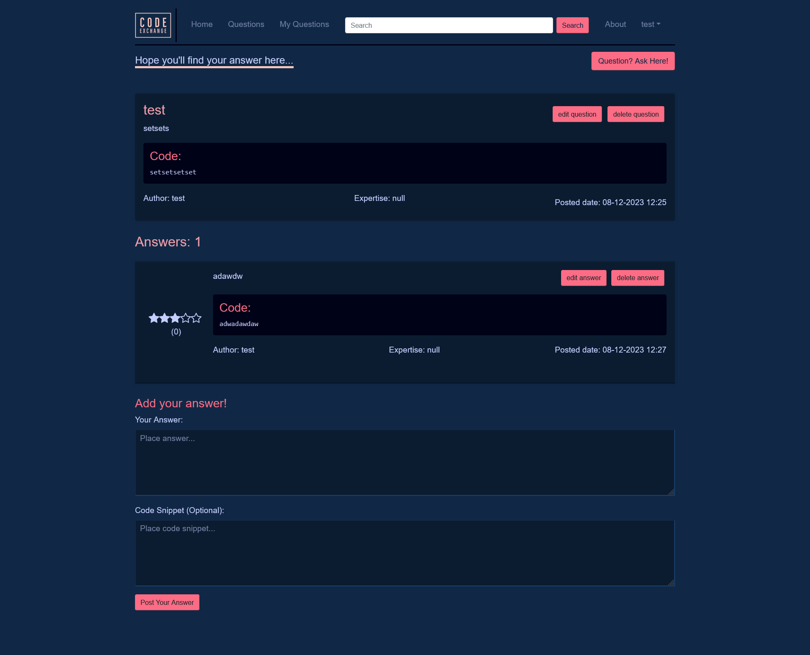

# Code Exchange
A code exchange website (like StackOverflow) where developers can ask- and answer questions! 

## Table of Contents
* [Indtroduction](#introduction)
* [Used technologies]()
* [Preview](#preview)
* [Installation](#installation)
* [Contact](#contact)

## Introduction
This project is an interactive website where developers can ask- and answer question. It is also possible to give a rating to answers, so people can see how reliable the answer is.   

## Used technologies
- **[TypeScript](https://www.typescriptlang.org/docs/)**: Ensures type-safe code for better maintainability.
- **HTML**: The standard markup language for creating and structuring content on the web.
- **CSS/[LESS](https://lesscss.org/)**: CSS styles the visual presentation, while LESS is a preprocessor that adds dynamic features like variables, nesting and mixins for easier styling management.
- **[Bootstrap](https://getbootstrap.com/)**
- **Node.js**: The runtime for building scalable network applications.
- **SQL**: For storing game states and user data.

## Preview
### Homepage


### Questions overview


### Ask question


### Question detail


## Installation

### Installing the project 
```
git clone https://github.com/Jayson-1307/Text-based-adventure-game.git
cd text-based-adventure-game
npm install
```

### Running the project
Run this command in the terminal:   
```
npm run dev
```

Open 'localhost:3000' in your browser, and the webshop should be shown!

## Contact
If you have any questions or saw something interesting, feel free to contact me!    
U can send me an email: jvanolffen@outlook.com or send me a direct message on [LinkedIn](https://www.linkedin.com/in/jayson-van-olffen/)! 
