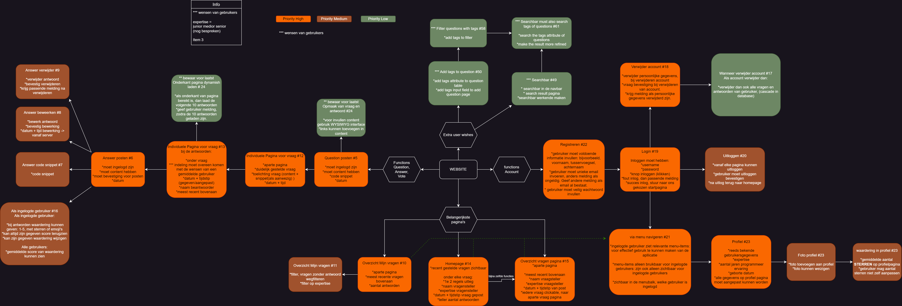
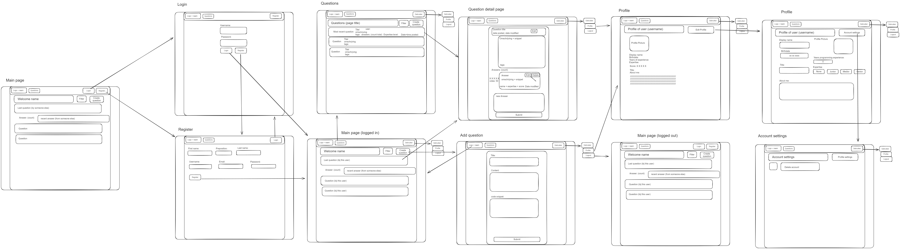

# Product review

## Inhoudsopgaven 

1. [Wat willen wij met dit document laten zien](#wat-willen-wij-met-dit-document-laten-zien)
2. [K2 - Je hebt de behoeftes van de doelgroep onderzocht en gebruikt om zelf een aantal user stories te schrijven](#k2---je-hebt-de-behoeftes-van-de-doelgroep-onderzocht-en-gebruikt-om-zelf-een-aantal-user-stories-te-schrijven)
    1. [Antwoorden op interview](#antwoorden-op-interview)
    2. [Zelf geschreven user stories]()
        1. [User story 1](#user-story-1)
        2. [User story 2](#user-story-2)
3. [K3 - Je hebt de gebruikersinterface van jouw product aangepast door prototyping toe te passen](#k3---je-hebt-de-gebruikersinterface-van-jouw-product-aangepast-door-prototyping-toe-te-passen)
    1. [Prototype](#prototype)
    2. [Feedback/tips op basis prototype](#feedbacktips-op-basis-prototype)
    3. [Nieuwe design](#nieuwe-design)
4. [K4 - Je hebt een testplan geschreven en gebruikt om een gebruikerstest uit te voeren](#k4---je-hebt-een-testplan-geschreven-en-gebruikt-om-een-gebruikerstest-uit-te-voeren)
    1. [Ons testplan](#ons-testplan)
    2. [Feedback na testplan](#feedback-na-test-plan)

## Wat willen wij met dit document laten zien 
Met dit document laten wij zien dat wij de kwaliteits- en gedragscriteria van de opleiding HBO-ICT begrijpen en ook gebruikt hebben in ons project. De onderdelen zijn per kwaliteits- en gedragscriteria gescheiden. Eerst de kwaliteitscriteria en daarna de gedragscriteria. 
Voor het gemak is een inhoudsopgaven aan het begin van dit document gemaakt. Aan het einde van dit document bevinden de bronnen die gebruikt zijn met het maken van deze documentatie.   

## K2 - Je hebt de behoeftes van de doelgroep onderzocht en gebruikt om zelf een aantal user stories te schrijven
Om aan te tonen dat wij voldoen aan de eisen die zijn gesteld voor K2, Hebben wij een aantal klasgenoten om input gevraagd. Dit hebben wij gedaan volgens de [richtlijnen van HBO-ICT Interviewen](https://knowledgebase.hbo-ict-hva.nl/2_professional_skills/onderzoekend_probleemoplossen/onderzoeken/interviewen/). We leidde het interview met de volgende vraag: "Wat is jouw verwachting/wat vind jij nodig op een code exchange website?". Op basis hiervan en [de tests die wij hebben gedaan](#feedback-na-test-plan) met een aantal developers, hebben wij een paar nieuwe user stories opgesteld. Op deze manier kunnen wij onze website meer naar wens van onze users maken, en zo iedereen een betere ervaring geven. De antwoorden van de mensen die wij onze vraag hebben gesteld, zijn hieronder te vinden.  

### Antwoorden op interview 
**Gurpreet**   
- Ik moet zelf vragen kunnen stellen/posten.
- Het zou fijn zijn als er snel antwoord gegeven word op de vragen die er worden gesteld.
- De website is overzichtlijk en makkelijk te gebruiken.
- Ik verwacht dat er een persoonlijke pagina is.
- Ik wil een overzicht kunnen zien van mijn gestelde vragen.

**Dion** 
- Ik verwacht dat de antwoorden in aparte code snippets staan, en niet in normale text voor extra duidelijkheid. 
- Een overzichtelijke en duidelijke user interface waarin de antwoorden op mijn probleem makkelijk en overzichtelijk te bekijken zijn. 
- Vragen kunnen opzoeken op basis van een gekozen code taal. 
- Er moet een mogelijkheid zijn om in te loggen
- Ik moet makkelijk mijn eigen gestelde vragen kunnen zien.
- Ik wil makkelijk kunnen zien of er nieuwe antwoorden zijn op mijn vragen. 

**Alessio**
- Ik verwacht dat ik serieuze antwoorden krijg op mijn vragen. 
- Ik verwacht ook zelf vragen te kunnen beantwoorden.
- Het vragenoverzicht moet netjes/overzichtelijk zijn. 
- Ik verwacht er zowel bij vragen als bij antwoorden, code in aparte code snippets gezet kan worden zodat dit duidelijker is om te lezen. 
 

### Zelf geschreven user stories 
Op basis van het onderzoek wat wij hebben gedaan (onder andere het interview, maar ook de [tests die wij hebben laten doen door een paar developers](#ons-testplan)), hebben wij een aantal user stories bedacht. Dit hebben wij gedaan volgens de [richtlijnen van de HBO-ICT User stories gewerkt hebben](https://knowledgebase.hbo-ict-hva.nl/1_beroepstaken/gebruikers_interactie/analyseren/userstories/). Deze bieden ons de mogelijkheid onze applicatie meer naar wens te maken van onze doelgroep. De zelfgemaakte user stories zijn als volgt: 

#### user story 1 
[#49 "Als gebruiker wil ik een search bar tot beschikking hebben zodat ik makkelijker een vraag kan opzoeken"](#49) 
    
#### user story 2
[#50 "Als ingelogde gebruiker wil ik tags kunnen toevoegen tijdens het aanmaken van een vraag"](#50)

#### User story 3
[#58 "Als gebruiker wil ik graag op tags kunnen filteren zodat er een overzicht beschikbaar word van de vragen binnen de gewenste tags."](#58)

#### User story 4
[#61 "Als gebruiker wil ik kunnen zoeken naar tags, zodat ik via de searchbar snel kan zoeken naar algemene vragen binnen mijn gewenste tag"](#61)

### Mindmap met user stories

## K3 - Je hebt de gebruikersinterface van jouw product aangepast door prototyping toe te passen
Om aan te tonen dat wij voldoen aan de eisen die zijn gesteld voor K3, maken wij gebruik gemaakt van de [richtlijnen van HBO-ICT Gebruikersinteractie Ontwerpen](https://knowledgebase.hbo-ict-hva.nl/1_beroepstaken/gebruikers_interactie/ontwerpen/0_gi_ontwerpen/). Wij hebben doormiddel van schetsen te maken en daarmee te testen (prototyping). Aan de hand van het [interview (te vinden in K2)](#antwoorden-op-interview), [de tests die wij hebben gerund met onze schetsen]() en de snelle doorloop van wat er nu al beschikbaar is op de website, zijn we op ideeën gekomen voor veranderingen aan user interface. In dit gedeelte zullen wij toelichten wat ons originele design was, wat onze nieuwe ideeën zijn en hoe we deze hebben verwerkt in ons nieuwe design. 

### Prototype
Hieronder is ons prototype te zien die wij hebben gebruikt voor ons onderzoek/onze testen.   

### Nieuwe design op basis van feedback
Hieronder is een het nieuwe/aangepaste design te zien, na de feedback die wij hebben gekregen. [De feedback kunt u hier vinden](#feedback-na-test-plan).   

## K4 - Je hebt een testplan geschreven en gebruikt om een gebruikerstest uit te voeren
Om aan te tonen dat wij voldoen aan de eisen die zijn gesteld voor K4, maken wij gebruik van de [richtlijnen van HBO-ICT Guirilla test](https://knowledgebase.hbo-ict-hva.nl/1_beroepstaken/gebruikers_interactie/realiseren/guerillatest/). Daarmee hebben wij een testplan gemaakt en deze uitgevoerd met behulp van een aantal programmeurs. Hieronder word het stap voor stap uitgelegd.

### Ons testplan
De test die wij hebben uitgevoerd ging als volgt: We lieten 3 programmeurs kijken naar ons [Prototype](#prototype) en lieten ze bepalen of alles logisch is. Hierna vroegen we of de user interface (voor zover te zien was) duidelijk was. Hierbij lieten we ook zien wat er tot nu toe al op de website staat, om zo meer gedetailleerde feedback te kunnen krijgen op kleinere dingen (zoals font-sizes. etc).

### Feedback na test plan
Op basis van de tests die we hebben uitgevoerd, hebben we wat tips en feedback gekregen van de 3 programmeurs die de test hebben uitgevoerd. Hieronder zal in een lijst overzicht aangetoond worden wat deze punten waren.   

- Zorg ervoor dat het duidelijk is waar je bent op de website;
- Er werd gewenst voor een effect als je over een menu items zweeft, dat brengt extra duidelijkheid;
- Misschien op de home page in plaats van 'recente vragen van gebruiker', 'algemene recente vragen';
- Een searchbar zodat je kan zoeken naar vragen waar jij misschien al mee zit, en je niet altijd een vraag hoeft te posten. 
- Tags kunnen toevoegen aan vragen, en hierop kunnen filteren en zoeken, om zo naar nog relevantere problemen kan zoeken die voor jou van toepassing zijn.

## Bronnen
<!-- 
Gelinkte documenten:
 -->
Bronnen van school:
* [richtlijnen van HBO-ICT Interviewen](https://knowledgebase.hbo-ict-hva.nl/2_professional_skills/onderzoekend_probleemoplossen/onderzoeken/interviewen/)
* [richtlijnen van HBO-ICT Gebruikersinteractie Ontwerpen](https://knowledgebase.hbo-ict-hva.nl/1_beroepstaken/gebruikers_interactie/ontwerpen/0_gi_ontwerpen/)
* [richtlijnen van HBO-ICT Guirilla test](https://knowledgebase.hbo-ict-hva.nl/1_beroepstaken/gebruikers_interactie/realiseren/guerillatest/)
<!-- 
Bronnen buiten school:
 -->

 <!-- Scorion
 
https://gitlab.fdmci.hva.nl/propedeuse-hbo-ict/onderwijs/2023-2024/out-d-se-gd/blok-2/joovuuzeefee27/-/blob/main/docs/sprint-1/Product-review.md?ref_type=heads#product-review

K2 - zelf: Op niveau / docent: Op niveau
Via deze onderdeel worden de bewijzen van "doelgroep onderzoek" getoond.
(zie bewijs).
Url:
https://gitlab.fdmci.hva.nl/propedeuse-hbo-ict/onderwijs/2023-2024/out-d-se-gd/blok-2/joovuuzeefee27/-/blob/main/docs/sprint-1/Product-review.md?ref_type=heads#k2-je-hebt-de-behoeftes-van-de-doelgroep-onderzocht-en-gebruikt-om-zelf-een-aantal-user-stories-te-schrijven

K3 - zelf: Op niveau / docent: Boven niveau
Via deze onderdeel worden de bewijzen van "gebruikersinterface van jouw product aangepast door prototyping" getoond.
(zie bewijs).
Url:
https://gitlab.fdmci.hva.nl/propedeuse-hbo-ict/onderwijs/2023-2024/out-d-se-gd/blok-2/joovuuzeefee27/-/blob/main/docs/sprint-1/Product-review.md?ref_type=heads#k3-je-hebt-de-gebruikersinterface-van-jouw-product-aangepast-door-prototyping-toe-te-passen

K4 - zelf: Op niveau / docent: Op niveau
Via deze onderdeel worden de bewijzen van "testplan geschreven en gebruikt om een gebruikerstest".
(zie bewijs).
Url:
https://gitlab.fdmci.hva.nl/propedeuse-hbo-ict/onderwijs/2023-2024/out-d-se-gd/blok-2/joovuuzeefee27/-/blob/main/docs/sprint-1/Product-review.md?ref_type=heads#k4-je-hebt-een-testplan-geschreven-en-gebruikt-om-een-gebruikerstest-uit-te-voeren

Bronnen
Url:
https://gitlab.fdmci.hva.nl/propedeuse-hbo-ict/onderwijs/2023-2024/out-d-se-gd/blok-2/joovuuzeefee27/-/blob/main/docs/sprint-1/Product-review.md?ref_type=heads#bronnen

Feedback:
K2: 
meer gericht op de wensen van de gebruikers, minder op de technische kant

K3:
Goed beeld van de flow. Geeft goed de interactie gedaan

K4:
Plan: Testplan schrijven, aangeven wat te vragen met als
Structuur: Helderder in de presentatie

  -->