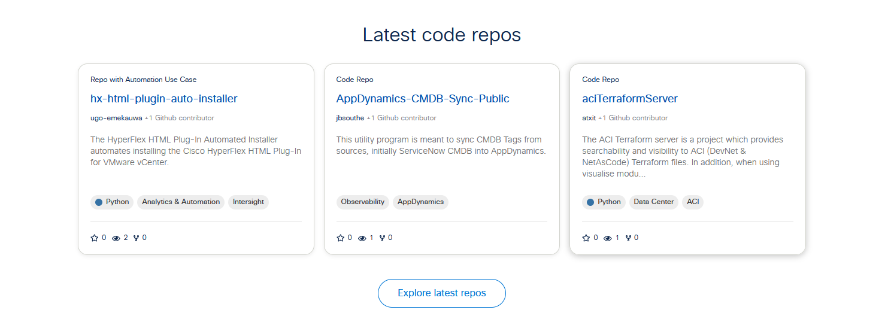
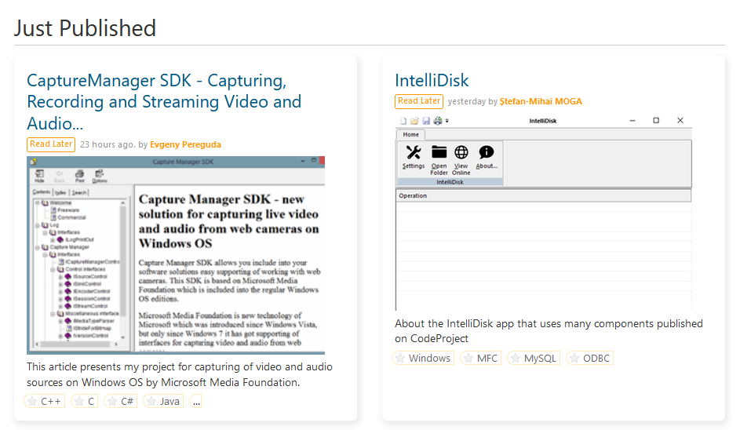
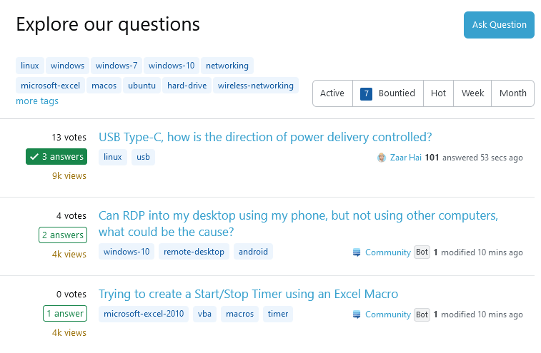
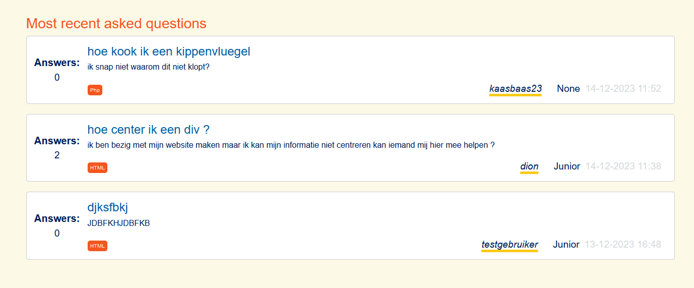

# Product review

## Inhoudsopgaven 

1. [Wat willen wij met dit document laten zien](#wat-willen-wij-met-dit-document-laten-zien)
2. [K2 - Inspiratie analyse](#k2---inspiratie-analyse)
3. [K3 - Je hebt de gebruikersinterface van jouw product aangepast door prototyping toe te passen](#k3---je-hebt-de-gebruikersinterface-van-jouw-product-aangepast-door-prototyping-toe-te-passen)
    1. [Prototype](#prototype)
    2. [Verwerkte feedback](#verwerkte-feedback)
    3. [Nieuwe design](#nieuwe-design)
4. [K4 - Je hebt een testplan geschreven en gebruikt om een gebruikerstest uit te voeren](#k4---je-hebt-een-testplan-geschreven-en-gebruikt-om-een-gebruikerstest-uit-te-voeren)
    1. [Ons testplan](#ons-testplan)
    2. [Feedback na testplan](#data-van-de-test)

## Wat willen wij met dit document laten zien 
Met dit document laten wij zien dat wij de kwaliteits- en gedragscriteria van de opleiding HBO-ICT begrijpen en ook gebruikt hebben in ons project. De onderdelen zijn per kwaliteits- en gedragscriteria gescheiden. Eerst de kwaliteitscriteria en daarna de gedragscriteria. 
Voor het gemak is een inhoudsopgaven aan het begin van dit document gemaakt. Aan het einde van dit document bevinden de bronnen die gebruikt zijn met het maken van deze documentatie.   

## K2 - Inspiratie analyse
Om aan te tonen dat wij voldoen aan de eisen die zijn gesteld voor K2, dit hebben wij volgens de [richtlijnen van HBO-ICT Inspiratie analyse](https://knowledgebase.hbo-ict-hva.nl/1_beroepstaken/gebruikers_interactie/analyseren/inspiratieanalyse/). 

### De vorige sprint hadden we het volgende als feedback gekregen.
- Overzichtelijk en duidelijke overzicht van vragen
- In plaats van de 3 meer recente vragen van jezelf, de 3 meest recent gestelde vragen over de gehele website tonen op de homepage.

#### Inspiratie voor de vragenlijst 

User story: 
#15 Als gebruiker wil ik een overzicht kunnen zien van alle gestelde vragen, zodat ik snel naar een vraag kan navigeren.
Als inspiratie voor de vragenlijst heb ik gekeken naar de websites die top posities hebben in de markt. Daaruit heb ik een paar screenshots gemaakt en hieronder gezet. 

De volgende onderdelen vallen bij de sites op:
* Alle sites maken met kleur, en rand duidelijk dat een antwoordt gegeven is, zodat deze meer opvalt dan als er geen antwoord gegeven is.
* Alle sites maken met kleur, rand, en vinkje duidelijk dat een antwoordt als oplossing geselecteerd is. Zodat deze nog meer opvalt dan als er alleen antwoorden zijn.
* Alle sites geven aan hoeveel antwoorden er gegeven zijn. Zodat als je een antwoord op deze vraag zoekt, deze niet eerst op een ander pagina geopend hoeft te worden.
* Alle sites geven aan om welke programeer talen het gaan. Zodat de gebruiker gemakkelijker weet of deze vraag voor hem is. 
* Alle sites geven aan hoelang geleden het antwoord gepost was. Zodat gekeken kan worden of deze vraag nog wel belangrijk is, of van toepassing is.
* 3 van de 4 sites geven aan wie de vraag gepost heeft.

[Stack overflow](https://stackoverflow.com/questions):  

[Super user](https://superuser.com/):  

[Codeproject](https://www.codeproject.com/script/Answers/List.aspx?tab=active):  

[Software engineering stack exchange](https://softwareengineering.stackexchange.com/):  

#### Design voor de vragenlijst 
Vanwege de overeenkomsten tussen deze websites hebben wij ervoor gekozen dat de lijst aan de volgende eisen moet voldoen:
* Andere opmaak als er een antwoord is, en nog eens een andere opmaak als een vraag een antwoord als oplossing gekozen heeft.
* Aantal antwoorden weergeven.
* Tags gebruiken
* Datum + tijd, wanneer de vraag gepost was. 

Daaruit is het volgende ontwerp gekomen:

 

## 

#### Inspiratie voor recente vragen op homepage
User story:
#14 Als gebruiker wil ik op de homepage een overzicht van de meest recente activiteiten zien, zodat ik gemakkelijk de nieuwste discussies kan bekijken. Als inspiratie voor dit onderdeel hebben we gekeken naar verschillende websites, die hoog worden beoordeeld door hun gebruikers. Hiervan hebben we screenshots gemaakt die hieronder zijn te vinden.

De volgende onderdelen vallen bij de sites op:
- Alle websites zorgen ervoor dat er een maximaal aantal staat op de recente vragen die worden getoond. 
- De meeste van de websites geven aan hoe oud de getoonde vragen zijn, zodat op basis hiervan getoond kan worden dat dit de recentste vragen zijn.
- De meeste van de websites geven aan wie de authors zijn.
- Alle websites onderscheiden het vraagvak van de website achtergrond met een border en/of box shadow/kleurverschil. Dit zorgt voor duidelijkheid op de pagina. 

[Cisco code exchange](https://developer.cisco.com/codeexchange/)   

[Codeproject](https://developer.cisco.com/codeexchange/)   

[ignitetech answerhub](https://ignitetech.com/softwarelibrary/answerhub)   

[Superuser](https://superuser.com/)   

#### Design voor recente vragen op homepage
Vanwege de overeenkomsten tussen deze websites hebben wij ervoor gekozen dat de lijst aan de volgende eisen moet voldoen:
- Een maximum aantal recente vragen instellen die worden ingeladen
- Duidelijk aangeven hoe oud de vraag is;
- Zorgen dat de author getoond word;
- Duidelijk onderscheid tussen de achtergrond 

Daaruit is het volgende ontwerp gekomen:   

## K3 - Je hebt de gebruikersinterface van jouw product aangepast door prototyping toe te passen
Om aan te tonen dat wij voldoen aan de eisen die zijn gesteld voor K3, maken wij gebruik gemaakt van de [richtlijnen van HBO-ICT Gebruikersinteractie Ontwerpen](https://knowledgebase.hbo-ict-hva.nl/1_beroepstaken/gebruikers_interactie/ontwerpen/0_gi_ontwerpen/). Wij hebben van ons schets design een interactief design in Figma gemaakt. We hebben deze design gebruikt voor het testen van onze website. Door deze testen zijn we op ideeën gekomen voor veranderingen aan user interface. In dit gedeelte zullen wij toelichten wat ons originele design was, wat onze nieuwe ideeën zijn en hoe we deze hebben verwerkt in ons nieuwe design. 

### Prototype
Hieronder is ons prototype te zien die wij hebben gebruikt voor ons onderzoek/onze testen.   

Url:
https://www.figma.com/proto/alC0NVnTPNcGlrYPJO0S1b/Code-Exchange?type=design&node-id=1-5&t=V8RgsgVSj4NNYxaX-0&scaling=min-zoom&page-id=0%3A1&starting-point-node-id=1%3A5

### Verwerkte feedback
Hieronder is een het verbeterde design te zien, na de feedback die wij hebben gekregen.
De volgende punten hebben wij in ons design aangepast:
* Optie om van de login pagina naar de register pagina te gaan
* Optie om van de register pagina naar de login pagina te gaan
* Navigatie balk toegevoegd aan, register en login pagina
* Tags bij vraag maken, aangepast naar "Programming languages"
* My Question verplaats naar Navigatie balk, niet meer in drop down
* intro bij homepage gezet
* About pagina gemaakt

 [De gehele feedback kunt u hier vinden](#k4---je-hebt-een-testplan-geschreven-en-gebruikt-om-een-gebruikerstest-uit-te-voeren).   

### Nieuwe design
Url:
https://www.figma.com/proto/alC0NVnTPNcGlrYPJO0S1b/Code-Exchange?type=design&node-id=77-104&t=V8RgsgVSj4NNYxaX-0&scaling=min-zoom&page-id=77%3A103&starting-point-node-id=77%3A104

## K4 - Je hebt een testplan geschreven en gebruikt om een gebruikerstest uit te voeren
Om aan te tonen dat wij voldoen aan de eisen die zijn gesteld voor K4, maken wij gebruik van de [richtlijnen van HBO-ICT Guirilla test](https://knowledgebase.hbo-ict-hva.nl/1_beroepstaken/gebruikers_interactie/realiseren/guerillatest/). Daarmee hebben wij een testplan gemaakt en deze uitgevoerd met behulp van een aantal programmeurs. Hieronder word het stap voor stap uitgelegd.

### Ons testplan
#### Ons en onze verwachtingen
**Doel**   
Het doel van deze playtest is om de effectiviteit, bruikbaarheid en efficientie van onze code-exchange website te evalueren en eventuele zwakke punten, bugs of gebieden voor verbetering te identificeren.

**Verwachtingen**   
Wij verwachten dat een gemakkelijke doorloop is van onze website. Daarnaast verwachten we dat de login en registreer processen makkelijk te doorlopen zijn. 

#### Testpersonen & taken voor testpersonen
*Testpersonen*   
We willen het prototype laten testen door zowel developers als niet developers. Op de manier willen we een mening krijgen van zowel mensen die verstand hebben van het onderwerp, maar ook neutrale meningen. Hiermee kunnen we de website voor iedereen zo gebruiks vriendelijk maken. 

*Taken voor gebruikers*
1. **Functionele testen: 1 keer volledige doorloop van website:**   
- Registratie process;
- Inlogprocess; 
- Vraag stellen;
- Vraag bekijken;
- Mijn vragen bekijken;
- Antwoord plaatsen;
- Zoeken en filteren;

2. Bruikbaarheidstesten:
- Navigatie: Beoordeel de algemene navigatie op de website en identificeer eventuele knelpunten of verwarrende secties.
- Gebruikersinterface: Beoordeel de esthetiek, consistentie en gebruiksvriendelijkheid van de gebruikersinterface.
- Responsiviteit: Test de website op verschillende apparaten (desktop, tablet, mobiel) en controleer of deze goed reageert en bruikbaar blijft op elk apparaat.

Hiermee zijn de volgende pagina's doorlopen: 
- Homepage;
- Login page; 
- Registratie page; 
- Add question page;
- Question overview page; 
- Question detail page; 
- My questions page; 
- Profile page;
- Edit profile page; 

#### Taken voor ons
- Bijhouden van interactie met website; 
- Bijhouden of de gebruikers duidelijk doorhebben waar ze zijn; 
- Bijhouden hoelang verschillende processen duren;
- Opvallend gedrag/acties noteren; 
- Feedback noteren; 

#### Data van de test

*Testpersoon 1:*    
*Interactie en Duidelijkheid van huidige locatie op website:*
De interactie met de website ging met deze testpersoon heel erg goed. Hij doorliep de verschillende processen vrij goed en vlot, en gaf aan waar hij moeite mee had. deze punten zijn genoteerd en worden later in het feedback gedeelte opgenoemd.

*Duur van verschillende processen:*
- Registratie process: precies een minuut. 
- Vraag plaatsen: dit is variabel voor hoe een grote vraag degene stelt.
- Inloggen: 15 seconden. 

*Opvallend gedrag:*      
Het enige wat ons opviel is dat de testpersoon niet echt zocht naar een profiel en my questions pagina. Toen ik later aangaf dat deze pagina's er waren, kon hij ze wel snel vinden. Hierbij gaf hij wel aan dat als ik het niet aan had gegeven, hij niet had geweten dat die pagina's er zijn. Hierover is ook feedback gegeven en dit heb ik weer genoteerd. 

*Feedback:*
- Zorg ervoor dat er een optie is om vanaf de login page naar de register page te gaan, en andersom;
- Voeg een optie toe om een geboorte datum toe te voegen aan het profiel. 
- Voeg een optie toe om je "years of experience" kan toevoegen, naast het al toegevoegde expertise attribute. 
- Er word nergens informatie aangegeven over de website. (Aanrader is om een kleine introductie toe te voegen aan de homepage, en misschien een 'about' of 'FAQ' page toe te voegen)
- Tijdens het toevoegen van een vraag is het nog erg onduidelijk wat er ingevoerd moet worden bij het kopje "Tags". Zorg hier voor meer uitleg.
- Zou fijn zijn om Questions te kunnen filteren op expertise niveau.
- Duidelijker aangeven welke pagina's er zijn op de website, of duidelijk de pagina's aangeven. 
- Searchbar werkend maken. 
## 
 

*Testpersoon 2:*    
*Interactie en Duidelijkheid van huidige locatie op website*
De interactie met de website ging voor dit testpersoon ook weer erg goed. De persoon ging vrijwel vlekkeloos door de website heen, en toen ik naderhand vroeg of het duidelijk was waar de gebruiker zich constant bevond, zei hij dat hij dat dit erg duidelijk was. 

*Duur van verschillende processen:*
- Registreren: 48 seconden.
- Vraag stellen: Variabel aan hoe groot de vraag is die word gesteld. 
- Inloggen: 2 seconden (informatie werd gelijk ingevoerd aangezien de testpersoon had geklikt op gegevens onthouden).

*Opvallend gedrag:*   
Alhoewel we de optie hebben om de website te gebruiken zonder in te loggen (met enkele limitaties), koos deze gebruiker ervoor om gelijk te registreren. Dit gaf aan dat deze optie voor de hand liggend genoeg is voor de gebruiker om dit snel te zien. Na het registeren, koos de testpersoon ervoor om gelijk een vraag te posten. Dit gaf ook weer aan dat deze optie erg voor de hand liggen was. 

*Feedback:*
- Mooiere en duidelijke hover effecten op items (bijvoorbeeld navigatie items, en om op een question te klikken in question overzicht blokken).
- Zou fijn zijn als er een korte inleiding zou zijn op de homepage.
- Een FAQ of about page zou gewenst zijn, zodat het duidelijk is voor gebruikers waar de website voor is en wat de opties zijn binnen de website. 
##
 

*Testpersoon 3:*  
*Interactie en Duidelijkheid van huidige locatie op website*
De interactie met de website voor dit testpersoon ging opnieuw erg goed. De persoon kon zich makkelijk door de website navigeren en was erg nieuwsgierig. De persoon klikte op alles en liep uit zichzelf alle processen door. Volgens de testpersoon was het constant duidelijk waar hij zich bevond op de website. 

*Duur van verschillende processen:*
- Registreren: 52 seconden
- Vraag stellen: variabel, ligt aan hoe groot de vraag is.
- Inloggen: 13 seconden

*Opvallend gedrag:*   
Dit testpersoon kwam uit zichzelf al op de myquestions en profiel page, waar de andere testpersonen wel moeite mee hadden.

*Feedback:*
- Een optie maken om vanaf de inlog/registratie page terug te gaan naar de website (voor als je toch niet wilt inloggen).
- Optie toevoegen om vanaf de login page naar de registratie page te kunnen gaan, en andersom. 
- Betere uitleg waar tags voor zijn.
- FAQ of Questions page.
- Korte intro op homepage. 

 

## Bronnen

Gelinkte documenten:
* [Figma prototype](https://www.figma.com/proto/alC0NVnTPNcGlrYPJO0S1b/Code-Exchange?type=design&node-id=1-5&t=V8RgsgVSj4NNYxaX-0&scaling=min-zoom&page-id=0%3A1&starting-point-node-id=1%3A5)
* [Figma nieuw design](https://www.figma.com/proto/alC0NVnTPNcGlrYPJO0S1b/Code-Exchange?type=design&node-id=77-104&t=V8RgsgVSj4NNYxaX-0&scaling=min-zoom&page-id=77%3A103&starting-point-node-id=77%3A104)

Bronnen van school:
* [richtlijnen van HBO-ICT Interviewen](https://knowledgebase.hbo-ict-hva.nl/2_professional_skills/onderzoekend_probleemoplossen/onderzoeken/interviewen/)
* [richtlijnen van HBO-ICT Gebruikersinteractie Ontwerpen](https://knowledgebase.hbo-ict-hva.nl/1_beroepstaken/gebruikers_interactie/ontwerpen/0_gi_ontwerpen/)
* [richtlijnen van HBO-ICT Guirilla test](https://knowledgebase.hbo-ict-hva.nl/1_beroepstaken/gebruikers_interactie/realiseren/guerillatest/)
* [richtlijnen van HBO-ICT Inspiratie analyse](https://knowledgebase.hbo-ict-hva.nl/1_beroepstaken/gebruikers_interactie/analyseren/inspiratieanalyse/)
<!-- 
Bronnen buiten school:
 -->

 <!-- Scorion
 
K2 - zelf: Op niveau / docent: Op niveau
Via deze onderdeel worden de bewijzen van "Inspiratie analyse" getoond.
(zie bewijs).
Url:
https://gitlab.fdmci.hva.nl/propedeuse-hbo-ict/onderwijs/2023-2024/out-d-se-gd/blok-2/joovuuzeefee27/-/blob/main/docs/sprint-2/Product-review.md?ref_type=heads#k2-inspiratie-analyse

K3 - zelf: Op niveau / docent: Boven niveau
Via deze onderdeel worden de bewijzen van "gebruikersinterface van jouw product aangepast door prototyping" getoond.
(zie bewijs).
Url:
https://gitlab.fdmci.hva.nl/propedeuse-hbo-ict/onderwijs/2023-2024/out-d-se-gd/blok-2/joovuuzeefee27/-/blob/main/docs/sprint-2/Product-review.md?ref_type=heads#k3-je-hebt-de-gebruikersinterface-van-jouw-product-aangepast-door-prototyping-toe-te-passen

K4 - zelf: Op niveau / docent: Boven niveau
Via deze onderdeel worden de bewijzen van "testplan geschreven en gebruikt om een gebruikerstest".
(zie bewijs).
Url:
https://gitlab.fdmci.hva.nl/propedeuse-hbo-ict/onderwijs/2023-2024/out-d-se-gd/blok-2/joovuuzeefee27/-/blob/main/docs/sprint-2/Product-review.md?ref_type=heads#k4-je-hebt-een-testplan-geschreven-en-gebruikt-om-een-gebruikerstest-uit-te-voeren

G7 - zelf: Op niveau / docent: Boven niveau

Bronnen
Url:
https://gitlab.fdmci.hva.nl/propedeuse-hbo-ict/onderwijs/2023-2024/out-d-se-gd/blok-2/joovuuzeefee27/-/blob/main/docs/sprint-2/Product-review.md?ref_type=heads#bronnen

Feedback:
K2:  Op niveau
Helder inspiratie en ontwerp, goede conclusies uit getrokken.
Moeilijker onderwerpen, minder voor de hand liggende.

K3: Boven niveau
Vanuit de user alle stories opgepast, niet alleen opmaak ook de moeilijkere dingen

K4: Boven niveau
Duidelijke bevindingen, test uitgevoerd en gedocumenteerd.
meerdere manieren naar gebruikers interactie gekeken.

G7: Boven niveau
goede lichaams taal, goed gesproken, goede structuur. 

  -->
