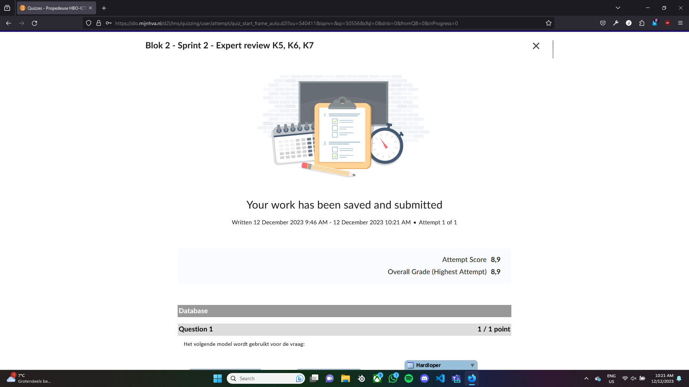

# Expert review quiz - Jayson van Olffen

## Screenshot quiz resultaat

 

## OOP

### Beheersingen
Over het algemeen heb ik OOP wel goed onder controle, ik snap over het algemeen wel hoe het werkt. 

### Verbeterpunten
De enige fout die ik had gemaakt, was omdat ik te snel mijn antwoord had gekozen. Het ging om een for loop die door een array ging, en dat hoort te beginnen bij nul en dat had ik goed, alleen de teller had ik fout. Naderhand zag ik dat ik het fout had, en begreep ik de fout ook vrijwel gelijk. Verder wil ik nog wel meer leren over hoe het meer advanced gedeelte van OOP werkt, maar dat komt met de tijd. 

  

## UML

### Beheersingen
UML had ik voor mijn gevoel wel het meeste moeite mee, maar ik begrijp nogsteeds in grote lijnen wel waar het om gaat. 

### Verbeterpunten
Wat ik zou zeggen dat ik moet verbeteren, is mijn kennis over de lijnen tussen classes in een classdiagram. verder had ik nog 

 

## Database 

### Beheersingen
Vrijwel Alle gedeeltes dat binnen Database valt heb ik wel prima kennis over. Vooral SQL queries en ERD's gaan vrij goed. 

### Verbeterpunten
Ik heb gemerkt dat ik meer moet werken aan mijn kennis over joins. Verder wil ik ook wel meer begrip krijgen van het omzetten van een ERD naar een EERD. 