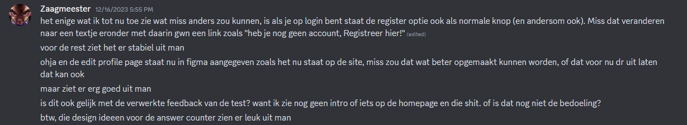
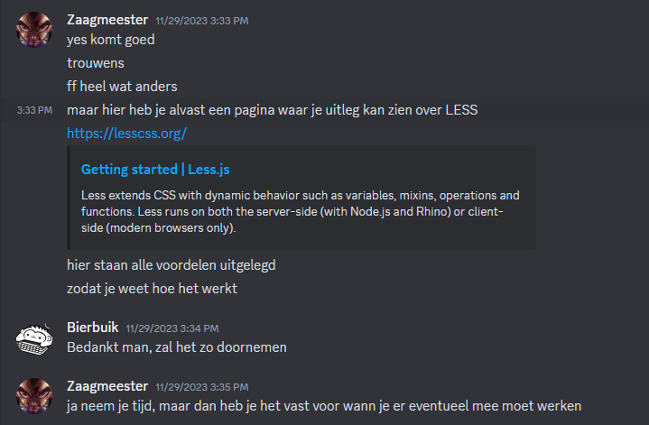
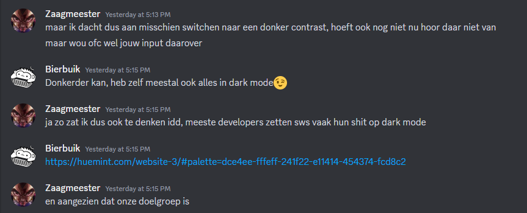

# Retrospective review

## Inhoud
1. [Inleiding](#inleiding)
2. [#G1 Persoonlijk leiderschap en samenwerking](#g1-persoonlijk-leiderschap-en-samenwerking)
    1. [Waaraan zou ik deze sprint gaan werken?](#waaraan-zou-ik-deze-sprint-gaan-werken)
    2. [Terugblik op sprint 2](#terugblik-op-sprint-2)
    3. [Feedback](#feedback)
        1. [Gegeven](#gegeven-aan-duo-partnercollega)
        2. [Gekregen](#gekregen-van-duo-partnercollega)
    4. [Verwerken feedback](#verwerken-feedback)
3. [G4 Je werkt volgens (gegeven) kwaliteitsnormen](#g4-je-werkt-volgens-gegeven-kwaliteitsnormen)
    1. [Je werkt volgens de agile methodiek van HBO-ICT](#je-werkt-volgens-de-agile-methodiek-van-de-opleiding-hbo-ict)
    2. [Je code voldoet aan de Google code conventions](#je-code-voldoet-aan-de-google-code-conventions-httpsgooglegithubiostyleguide)
    3. [Je code is (technisch) gedocumenteerd en relevant voor collega ontwikkelaars](#je-code-is-technisch-gedocumenteerd-en-relevant-voor-collega-ontwikkelaars)
    4. [Je communiceert professioneel en gestructureerd](#je-communiceert-professioneel-en-gestructureerd)
4. [G5 Constructief samenwerken in een duo](#g5-constructief-samenwerken-in-een-duo)

## Inleiding
In dit document reflecteer ik op hoe de 1e sprint ging voor mij. Zowel individueel als met mijn duo. Ik heb zelf gereflecteerd en heb ook feedback verzameld van mijn collega. 

## G1 Persoonlijk leiderschap en samenwerking
### Waaraan zou ik deze sprint gaan werken?
Op basis van mijn reflectie op/feedback van vorige sprint, waren dit de punten waar ik deze sprint aan wou werken.
- Ik wil meer up-to-date zijn met de status van mijn partner in het project;
- Ik wil sneller/meer vragen stellen (vooral aan mijn duo partner);
- Ik wil (samen met mijn duo) de taken beter verdelen;

#### Ik wil meer up-to-date zijn met de status van mijn partner in het project
Ik merkte vorige sprint dat ik vaak niet echt up-to-date was met waar wesley mee bezig was. Dit zorgde soms een beetje voor vraagtekens voor mij, maar gelukkig is dat deze sprint een stuk minder geworden. Wesley en ik hebben veel meer gesproken over waar we mee bezig zijn/wat we net hebben gedaan. Ik denk dat dit veel invloed heeft gehad in de grote sprong in productiviteit die we deze sprint hadden. Ook hebben op discord nu een server waarin wij kunnen zien wanneer de ander iets pushed, en hierbij plaatsen wij dan een bericht met wat er gepushed is. Dit had ook een heel groot aandeel in de ontwikkeling van ons teamwerk. 

#### Ik wil sneller/meer vragen stellen (vooral aan mijn duo partner)
Vooral aan dit gedeelte heb ik veel gewerkt. Ik merkte dat teveel twijfelen over of ik een vraag mij echt heel veel kostbare tijd kostte. Ik wou hier graag vanaf, zodat ik efficienter, maar ook met meer zekerheid aan het project kon werken. Dit blok heb ik mezelf aangeleerd om sneller vragen te stellen, en ik merkte dat dit goed uitpakte. Het gaf mij heel veel meer duidelijkheid over wat ik moest doen. Wesley heeft hier ook heel erg mee geholpen, door altijd veel geduld te hebben. Ook heb ik heb echt gemerkt dat hij het niet erg vind als ik vragen stel. Dit wil ik natuurlijk verder blijven ontwikkelen, zodat dit verder geen hindernis meer zal zijn voor mij. 

#### Ik wil (samen met mijn duo) de taken beter verdelen
We merkte vorige sprint dat onze taken niet zo goed verdeeld waren en we daardoor soms met het werk een beetje langs elkaar heen gingen. Deze sprint hebben we aan het begin gelijk naar onze mindmap gekeken (hierin staan alle user stories verwerkt op basis van de relaties die ze hebben met elkaar), en op basis hiervan de taken verdeeld. We merkte dat hierdoor onze taken voor deze sprint veel duidelijker waren. We hebben veel productiever gewerkt en we gaan het volgende sprint ook zeker weer op deze manier doen.

### Terugblik op sprint 2
Deze sprint hebben als duo, maar ik ook individueel veel kunnen bereiken. Ik heb een grotere bijdrage kunnen leveren aan het project dan vorige sprint, en ik heb gemerkt dat ik ook echt plezier haal uit werken aan dit project. We hebben deze sprint een hoop meer user stories af kunnen ronden, en over het algemeen een hele grote sprong gemaakt in het project. De samenwerking heeft (alhoewel dit echt al heel goed ging), ook goede ontwikkelingen gemaakt. We hebben dagelijks contact (behalve soms in de weekenden), en bespreken heel veel met elkaar. 

Natuurlijk zijn er ook altijd nog verbeterpunten, want het gaat natuurlijk nooit perfect. De volgende punten zijn dingen waar ik vanaf nu aan wil gaan werken:
* Ik wil me nog iets meer bezighouden met de backend. 
    Ik heb gemerkt doordat ik vrij gevorderd ben qua front-end, ik snel neig om daaraan te werken. alhoewel dit voor het project ook ze voordelen heeft, is het voor mijn eigen ontwikkeling natuurlijk ook nodig om genoeg tijd aan de backend te besteden. Ik wil dit gaan doen door samen met wesley te bespreken welke extra backend dingen ik nog op zou kunnen pakken om op deze manier meer kennis en ervaring op te doen hiermee. Ook zal ik uit mezelf meer dingen proberen als ze in me opkomen (na dit natuurlijk te hebben besproken met wesley). 

* Nu de taakverdeling beter gaat, willen we dit nu ook graag beter in kaart brengen.
    We lichten elkaar nu goed in over de volgende dingen zodra we iets mergen: wat is klaar, waar heeft dit invloed op, wat gaan we nu doen.
    We moeten dit alleen ook meteen in Gitlab Issue Board aanpassen, zodat de onderdelen die klaar zijn het niet on overzichtelijk maken. Hieraan gaan we werken door voortaan als we iets afgerond hebben ook de Issue Board aan te passen. Voordat we aan de volgende Issue beginnen.

### Feedback
#### **Gegeven (aan duo partner/collega)**
**Positief:**
- Neemt veel initatief
- Goede positieve houding
- Heeft veel geduld
- Gezellig

**Constructief:**
- De documenten die bijgehouden moesten worden, heb je nu teveel van gemaakt.  
- Code was nog niet veilig genoeg.

#### **Gekregen (van duo partner/collega)**
**positief:** 
- Positieve houding
- Gezellig
- Denkt goed mee

**constructief:**
- "Iets doelgerichter werken".
- "Beter je tijd managen, om zo effectiever aan het project te werken".

### Verwerken feedback
Beide feedback punten kan ik wel herkennen als ik terug kijk op deze sprint. Ik merkte dat wanneer ik aan vooral de backend werkte, en dan een idee kreeg voor de front-end, ik gelijk dat wou gaan verwerken. Hierdoor werd het afmaken van bepaalde backend related user stories uitgesteld. Om dit te verbeteren in het volgende blok, ben ik van plan een notitie bestand of kladblok bij te houden. Hierin kan ik wanneer ik een idee krijg, een notitie daarvan maken zodat ik na het afronden van mijn huidige focus mijn nieuwe ideeen kan behandelen.   
Het andere feedback punt, kan ik mezelf ook heel erg in vinden en moet ook wel echt verbeterd worden. Ik heb ondanks dat wanneer ik werkte, ik veel deed, vaak gehad dat er iets persoonlijks tussen kwam afgelopen sprint. Vaak waren dit dingen die ik wel al wist dat ik moest doen, maar was vergeten. Dit verpeste vaak de productiviteit uit mijn kant. Ik zal komende sprint beter mijn tijd managen door in ieder geval een agenda bij te houden. Hierin kan ik alle veel tijd innemende bezigheden zetten die voor mij gepland zijn. op deze manier kan ik beter mijn tijd managen. Ik ga er vanuit dat dit cruciale veranderen zullen zijn, die de productiviteit volgend blok nogmeer omhoog zal helpen.
 

## G4 Je werkt volgens (gegeven) kwaliteitsnormen
### Je werkt volgens de agile methodiek van de [opleiding HBO-ICT](https://knowledgebase.hbo-ict-hva.nl/2_professional_skills/toekomstgericht_organiseren/managen/scrum/)
We hebben volgens de agile methode van de [opleiding HBO-ICT Scrum](https://knowledgebase.hbo-ict-hva.nl/2_professional_skills/toekomstgericht_organiseren/managen/scrum/) gewerkt.

1. Aan het begin van de sprint, hebben wij de product backlog en de feedback van de vorige sprint gebruikt om een planning te maken. Deze planning was gebaseerd op het feit dat we dan met zo min mogelijk werk, zoveel mogelijk feedback konden verzamelen. Dus een Minimum Viable Product (MVP).
2. We hebben met regelmaat gesprekken over de voortgang van de werkzaamheden. Dit zijn alle contact momenten en geplande besprekingen voor het glad strijken van nieuwe drempels in de werkzaamheden. Tevens lichten we elkaar in, en vragen we om de meningen van onze collega's gedurende de dag over de gemaakte/aangepaste onderdelen.
3. We verzamelen feedback op het Minimum Viable Product (MVP) voor de product review door een testplan te schrijven en deze te gebruiken tijdens [Guerilla  testing](https://knowledgebase.hbo-ict-hva.nl/1_beroepstaken/gebruikers_interactie/realiseren/guerillatest/).
4. Daarna evalueren we in een bespreking (ook wel genaamd 'Restrospecitve') onze aanpak die heeft geleid tot onze resultaat deze sprint. Deze kennis gebruiken we in de volgende sprint, om zo de werkzaamheden te blijven verbeteren.

### Je code voldoet aan de google code conventions [(https://google.github.io/styleguide/)](https://google.github.io/styleguide/)
Het bewijs dat ik voldoe aan de code conventions, heb ik in een apart bestand gezet. [Bekijk hier het bewijs](./code-conventions-jayson.md)

### Je code is (technisch) gedocumenteerd en relevant voor collega ontwikkelaars.
nze documentatie is vastgelegd volgens de [HBO-ICT Documenteren](https://knowledgebase.hbo-ict-hva.nl/2_professional_skills/doelgericht_interacteren/communiceren/documenteren/). Tijdens de Expert review kregen we de feedback dat we te uitgebreid code hadden laten zien. Dit hebben we verbeterd door [Google TypeScript Style Guide](https://google.github.io/styleguide/tsguide.html) te hanteren. [Klik hier voor onze technische documentatie](../technische%20documentatie.md)

### Je communiceert professioneel en gestructureerd
Onze communicatie verloopt zeer goed dit doen we door de [HBO-ICT richtlijnen voor Communiceren](https://knowledgebase.hbo-ict-hva.nl/2_professional_skills/doelgericht_interacteren/communiceren/0_communiceren/) te hanteren.

tijdens het communiceren let ik op de volgende punten:
1. Ik probeer zoveel mogelijk rekening te houden met de gevoelens, normen en waarden van de andere.
2. Ik geef constructieve feedback op een positieve manier. 
3. Naast constructieve feedback, complimenteer ik mijn collega's ook als er iets goed gaat.
4. Ik onderbouw mijn meningen/ideeen met duidelijke argumenten.
5. Tijdens het communiceren is mijn doel duidelijk. 
6. Ik hou rekening met de voorkennis van mijn collega

#### Voorbeelden van communicatie via discord:   
Voorbeeld 1:    
   
##
Voorbeeld 2:    
    
##
Voorbeeld 3:   
   
 

## G5 Constructief samenwerken in een duo
### Samenwerkingscontract
**We bespreken alles:**  
- Is iets ontduidelijkheid neem contact op (discord, whatsapp, teams) 
- Overlast bestaat niet, geen tijd mute manieren van contact of zeg: ik nu niet.
- Slechte vragen stellen bestaan niet.
- Heb begrip dat iemand nu niet kan antwoorden en of geen tijd heeft.

**Wat als er problemen zijn:**   
Als er problemen zijn, bespreek dit. De andere moet minimaal meedenken en proberen te begrijpen waar de andere met het probleem vandaan komt. (vat het niet persoonlijk op)

**Verwachting:**   
- Gemotiveerd om aan het project te werken.
- Taak verdeling, op basis van mindmap
- Afvinken van onder delen in de "mindmap aangepast.drawio".
- Elkaar updaten over , wat pak je op, wat je af hebt.

**Elkaar feedback geven:**   
hou het netjes, vat het niet persoonlijk op. Maar zeg wel duidelijk waar je het over wilt hebben. 

### Hoe ging het in het 2e blok met het houden aan dit contract?
Ik vind dat wij ons heel goed aan het samenwerkingscontract hebben gehouden. 

