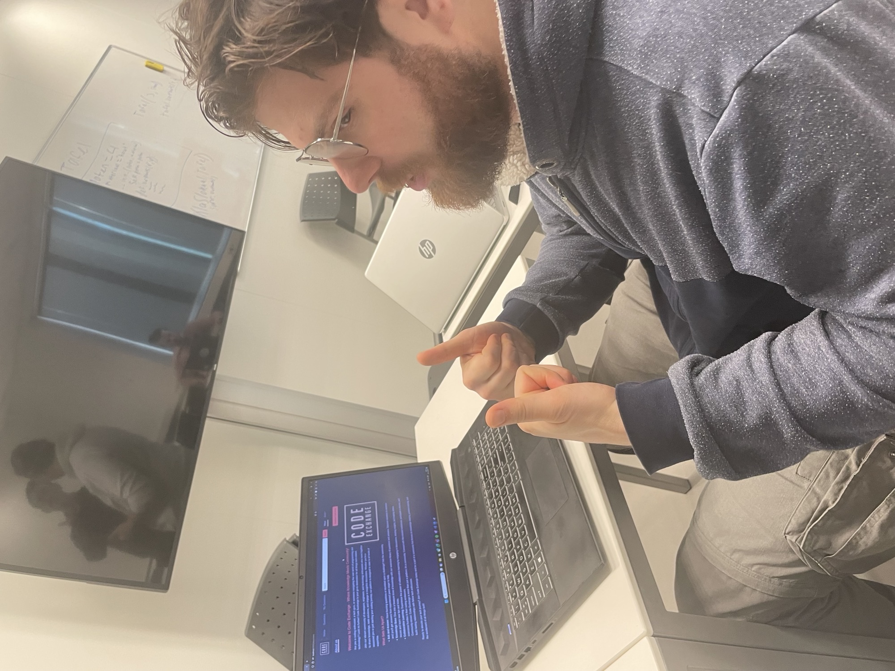
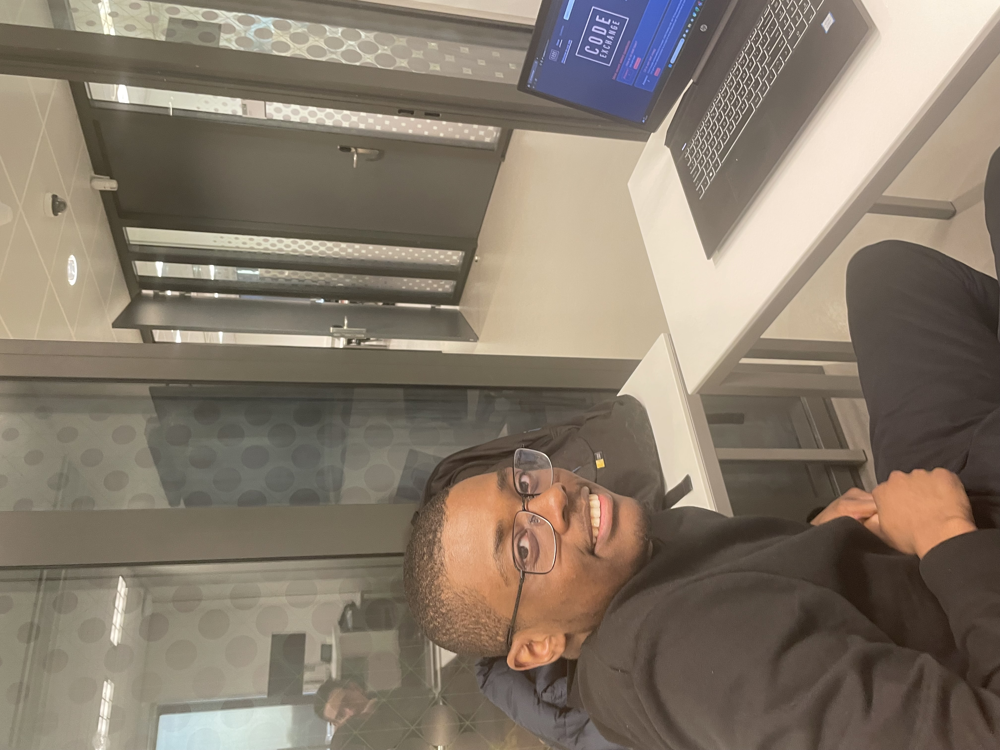
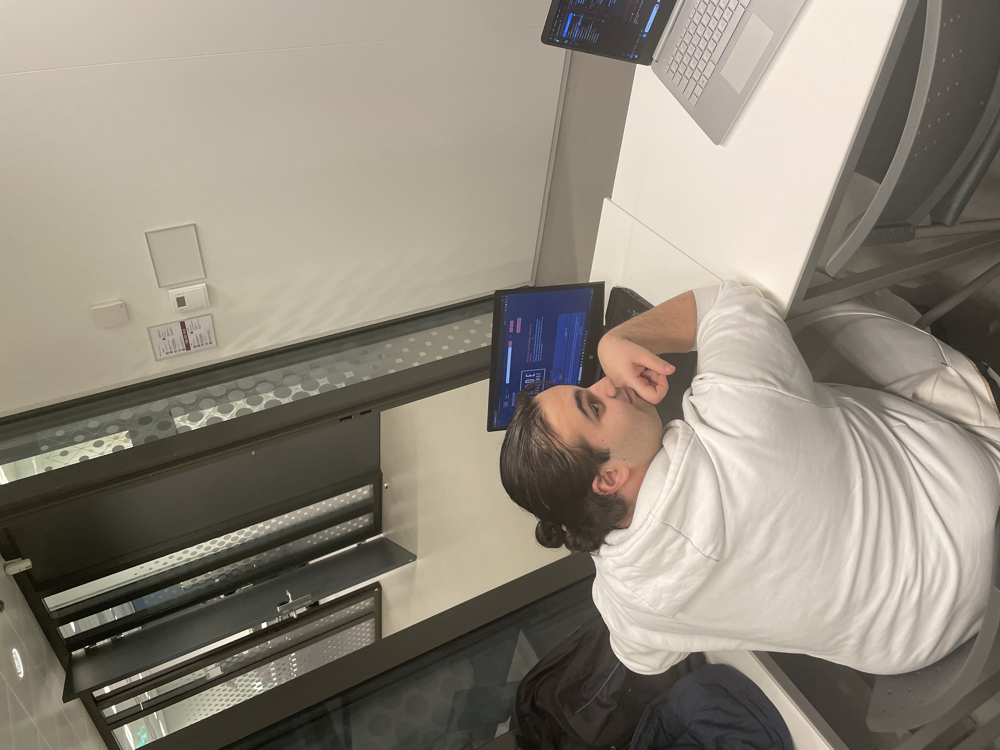

# Product review

## Inhoudsopgaven 

1. [Wat willen wij met dit document laten zien](#wat-willen-wij-met-dit-document-laten-zien)
2. [K2 - Oude design](#k2---oude-design)
    <!-- 1. [Figma design](#figma-design)
    2. [Feedback op oude design](#feedback-op-oude-design) -->
3. [K1 - User stories](#k1---user-stories)
4. [K3 - Huidige website met verwerkte Feedback](#k3---huidige-website-met-verwerkte-feedback)
5. [K4 - Testplan](#k4---testplan)
    <!-- 1. [Testplan](#testplan)
        1. (Gebruikersdoelen)[]
        2. (Vragen (tevredenheid))[]
    2. [Testpersoon 1](#testpersoon-1)
    3. [Testpersoon 2](#testpersoon-2) -->
6. [Alle gebruikte bronnen](#alle-gebruikte-bronnen)

## Wat willen wij met dit document laten zien 
Met dit document laten wij zien dat wij de kwaliteits- en gedragscriteria van de opleiding HBO-ICT begrijpen en ook gebruikt hebben in ons project. De onderdelen zijn per kwaliteits- en gedragscriteria gescheiden, en in een goede volgorde gezet voor een goedlopend verhaal.
Voor het gemak is een inhoudsopgaven aan het begin van dit document gemaakt. Aan het einde van dit document bevinden de bronnen die gebruikt zijn met het maken van deze documentatie.

## K2 - Oude design
We zullen even laten zien waarmee we qua uiterlijk deze sprint begonnen, en wat de feedback hierop was. Op deze manier kunnen we een goed beeld krijgen van wat er precies is verbeterd in deze sprint.   

### Figma design
Url:   
https://www.figma.com/proto/alC0NVnTPNcGlrYPJO0S1b/Code-Exchange?type=design&node-id=1-5&t=V8RgsgVSj4NNYxaX-0&scaling=min-zoom&page-id=0%3A1&starting-point-node-id=1%3A5

### Feedback op oude Design
* Graag een optie om van de login pagina naar de register pagina te gaan;
* Graag een optie om van de register pagina naar de login pagina te gaan;
* Graag een navigatie balk toevoegen aan register en login pagina's;
* Graag het 'tags' gedeelte bij vraag stellen pagina duidelijker aangeven;
* Graag het makkelijker maken om te navigeren naar MyQuestions;
* Graag een intro op de homepage;
* Graag een informatie pagina toevoegen, waar er informatie over de website te zien is;
* Het zou fijn zijn als de website ook volledig responsive is;
* De website zou een stuk gebruiksvriendelijker zijn als het kleurenschema donker zou zijn, voor als je de website voor lange tijd open hebt staan;   
 

### Bronnen:
* [Figma prototype](https://www.figma.com/proto/alC0NVnTPNcGlrYPJO0S1b/Code-Exchange?type=design&node-id=1-5&t=V8RgsgVSj4NNYxaX-0&scaling=min-zoom&page-id=0%3A1&starting-point-node-id=1%3A5)
* ["Dropdown menu in Figma" van Nick Babich](https://www.youtube.com/watch?v=MTKttcfEkKk)
* ["Create a DROPDOWN MENU in Figma (Tutorial)" van Mavi Design](https://www.youtube.com/watch?v=uI3k9Ol-Mp4)
* [richtlijnen van HBO-ICT Prototpe](https://knowledgebase.hbo-ict-hva.nl/1_beroepstaken/gebruikers_interactie/ontwerpen/prototype/)

## K1 - User stories
Hier tonen we de user stories en onze vooruitgang van het project.
De user stories die wij deze sprint ingepland, hadden als doel zoveel mogelijk feedback punten te verbeteren.

<!-- ### Welke user stories hadden we in TODO geplaatst voor deze sprint
De volgende user stories hebben we bij het begin van sprint 3 in TODO geplaatst:

*Wesley* 
* #8 Als gebruiker wil ik mijn gegeven antwoorden kunnen bewerken, zodat ik deze kan wijzigen.
* #9 Als gebruiker wil ik een door mij gegeven antwoord kunnen verwijderen, zodat mijn fouten/vergissingen het overzicht niet vertroebelen.
* #16 Als ingelogde gebruiker wil ik het antwoord van een andere gebruiker kunnen waarderen, zodat zichtbaar is wat de gemiddelde waardering van zijn bijdragen zijn.
* #17 Als gebruiker wil ik dat bij het verwijderen van mijn account dat ook al mijn vragen en antwoorden verwijderd worden, zodat er geen gegevens van mij meer bekend zijn.
* #18 Als gebruiker wil ik mijn account kunnen verwijderen, zodat mijn persoonlijke gegevens niet meer zichtbaar zijn.
* #25 Als gebruiker wil ik op mijn profielpagina het gemiddelde aantal sterren zien, zodat ik kan zien hoe mijn bijdragen gewaardeerd worden.
* #27 Als gebruiker wil ik opmaak kunnen toepassen op mijn vraag en antwoord, zodat mijn vraag of antwoord beter leesbaar is.
* Extra #50 Tags toevoegen aan vragen tijdens creatie, zodat als ingelogde gebruiker ik tags kan toevoegen aan mijn vraag
* #66 Als gebruiker wil ik graag een informatie pagina, zodat de algemene informatie van de website makkelijk gevonden kan worden.

*Jayson*
* #11 Als gebruiker wil ik vragen in het overzicht kunnen filteren, zodat ik makkelijk voor mij relevante vragen kan terugvinden.
* #23 Als gebruiker wil ik mijn profiel kunnen bewerken, zodat mijn gegevens kloppen.
* #24 Als gebruiker wil ik een foto toe kunnen voegen aan mijn profiel, zodat ik herkenbaar ben binnen de community.
* #28 Als gebruiker wil ik dat iedere tien antwoorden dynamisch geladen worden, zodat ik niet steeds op volgende of vorige hoef te klikken.
* #49 Als gebruiker wil ik een search bar tot beschikking hebben, zodat ik makkelijker een vraag kan opzoeken.
* Extra #64 Als gebruiker wil ik dat de opmaak van de website volledig responsive is, zodat ik op elk apparaat de website goed kan gebruiken.
* Extra #65 Als gebruiker, wil ik graag dat het kleurenschema wat donkerder is, zodat het wat gebruiksvriendelijker is voor mensen die lange tijd deze website open moeten hebben

*Nog onverdeeld*
* #58 Als gebruiker wil ik graag op tags kunnen filteren, zodat de vragen overzicht verbeterd wordt door alleen gewenste tags te tonen.
* #61 Als gebruiker wil ik dat zoeken ook de tags bekijkt, zodat ik via de searchbar snel kan zoeken naar vragen binnen mijn gewenste tag
 -->

### Wat is de status(TODO, DOING, DONE) van elke user story van de sprint op dit moment?

Aan de hand van de volgende tabel ziet u wat de status is van elke user story in deze sprint op dit moment is.

### De vooruitgang van de user stories
Met deze onderdeel ziet u wat de vooruitgang is in cijfers.

**Bestaande User Stories**
| Gegevens| Aantal |
| --- | --: |
| Totaal US school | 24 |
| Totaal US extra  | 7 |  

   

**User Stories gemaakt**
| Gegevens| Aantal |
| --- | --: |
| Sprint 1 | 5 |
| Sprint 2 | 8 |
| Sprint 3 | 14 | 
| School US | 23 |
| Extra US | 4 |

*Project is volgens alleen de school User Stories 96% af. Dit zijn alleen nog één low priority stories.*   

 

### Bronnen:
* [richtlijnen van HBO-ICT Scrum](https://knowledgebase.hbo-ict-hva.nl/2_professional_skills/toekomstgericht_organiseren/managen/scrum/)
* [Gitlab Issue Boad](https://gitlab.fdmci.hva.nl/propedeuse-hbo-ict/onderwijs/2023-2024/out-d-se-gd/blok-2/joovuuzeefee27/-/boards/16233?milestone_title=Sprint%203)

## K3 - Huidige website met verwerkte Feedback
Met de genoemde punten in ons achterhoofd, kunnen we gaan kijken naar hoe wij deze punten hebben verwerkt. We zullen nu onze website doorlopen en aantonen hoe wij de feedback verwerkt hebben.
 

## K4 - Testplan
Hier zullen we door ons testplan heenlopen. We hebben een testplan opgesteld en uitgevoerd en daarmee feedback verzameld, die een cruciaal aandeel kunnen zijn bij het beste uit ons product halen. We hebben onze testpersonen goed geobserveerd zodat we tot in de kleine details hun gedrag konden noteren. 

### Gebruikersdoelen

Zet hier welke gebruikersdoelen je wilt testen (minstens 3) en bij welke feature ze horen.

#### Gebruikersdoel 1
> Gebruikersdoel: Post en edit een vraag & antwoord

> Feature: add-question & question detail 

#### Gebruikersdoel 2
> Gebruikersdoel: Geef een antwoord een beoordeling, en verander de beoordeling. 

> Feature: Question detail -> answer

#### Gebruikersdoel 3
> Gebruikersdoel: Bekijk en pas profiel aan.

> Feature: Profiel & edit-profile   

    

### Vragen (tevredenheid)

Bedenk minstens 2 vragen die je gaat stellen aan testpersonen over hun 'tevredenheid' over de applicatie. Eentje geven we je al mee, maar je mag ook een andere vraag bedenken.

1. Hoe bevielen de edit functions?
2. Hoe verliep voor jou de navigatie door de website?
3. Hoe gebruiksvriendelijk vond je de website, qua design?

&nbsp;
&nbsp;
&nbsp;

### Testpersoon 1
#### Basisinformatie

Naam proefpersoon: Jur van Oerle
Datum test: 22-1-2024

#### Resultaattabel
|   #   |   Doel/User Story                        | Effectiviteit |   Efficiëntie        | Tevredenheid |
|-------|------------------------------------------|---------------|----------------------|--------------|
|       |   Wat moet je gebruiker kunnen bereiken? | Doel behaald? |   Tijd               |     /10      |
|   1   |   Vraag posten & editen                  |   ja          |   2:47 min           |     7/10     |
|   2   |   Beoordeling                            |   ja          |   20 sec             |     7/10     |
|   3   |   Bekijk & edit profile                  |   ja          |   2 min              |     7/10     |

#### Observaties (wat deed en zei je testpersoon tijdens de test)
- Probeerde expres bugs te zoeken;
- Navigeerde goed en snel;
- Ging uit zichzelf alles na;
- Klikte op profiel eerst op individuele elementen om ze te proberen aan te passen; 
- zette de optie voor pop-ups uit, dit zorgde voor wat bugs;

#### Antwoorden op de vragen (tevredenheid)
- 1. Hoe bevielen de edit functions?
    - Het was een beetje onduidelijk wanneer je de elementen kon editen;
    - Het was cool dat je op de pagina zelf de elementen kon aanpassen;

- 2. Hoe verliep voor jou de navigatie door de website? 
    - Best wel makkelijk, hoefde niet lang te zoeken;

- 3. Hoe gebruiksvriendelijk vond je de website, qua design?
    - Indeling is erg goed
    - Goed gebruik gemaakt van beschikbare ruimte;
    - Kleurenthema: de accentkleuren (rood/roze) kan afschrikken, maar wel slim om een donker kleurenschema te gebruiken.

#### Foto (bewijsmateriaal)

 

#

### Testpersoon 2
#### Basisinformatie

Naam proefpersoon: Suheny 
Datum test: 22-1-2024  

#### Resultaattabel
|   #   |   Doel/User Story                        | Effectiviteit |   Efficiëntie        | Tevredenheid |
|-------|------------------------------------------|---------------|----------------------|--------------|
|       |   Wat moet je gebruiker kunnen bereiken? | Doel behaald? |   Tijd               |     /10      |
|   1   |   Vraag posten & editen                  |   ja          |   3 min              |     9/10     |
|   2   |   Beoordeling                            |   ja          |   2 min              |     9/10     |
|   3   |   Bekijk & edit profile                  |   ja          |   2 min              |     9/10     |

#### Observaties (wat deed en zei je testpersoon tijdens de test)
- Ging vlot door website heen;
- erg positieve instelling;
- gaf veel complimenten over dingen die hij leuk vond om te zien; 

#### Antwoorden op de vragen (tevredenheid)
- 1. Hoe bevielen de edit functions:
    - Erg leuk hoe je de velden zelf aanpast op dezelfde pagina;
    - Was niet super duidelijk hoe het werkte in het begin, maar zodra je het weet heel handig!;

- 2. Hoe verliep voor jou de navigatie door de website? 
    - Prima, vlot;
    - Alles was erg duidelijk;
    - Buttons zijn overzichtelijk;

- 3. Hoe gebruiksvriendelijk vond je de website, qua design?
    - kleurenschema is erg mooi, zou wat kleine tweaks kunnen gebruiken voor wat meer dynamiek tussen blokken en achtergrond;
    - Indeling is erg nice, en overzichtelijk;  

#### Foto (bewijsmateriaal)

 

# 
### Testpersoon 3
#### Basisinformatie

Naam proefpersoon: Umit   
Datum test: 22-1-2024   

#### Resultaattabel
|   #   |   Doel/User Story                        | Effectiviteit |   Efficiëntie        | Tevredenheid |
|-------|------------------------------------------|---------------|----------------------|--------------|
|       |   Wat moet je gebruiker kunnen bereiken? | Doel behaald? |   Tijd               |     /10      |
|   1   |   Vraag posten & editen                  |   ja          |   1:30 min           |     9/10     |
|   2   |   Beoordeling                            |   ja          |   1 min              |     8.5/10   |
|   3   |   Bekijk & edit profile                  |   ja          |   2 min              |     8/10     |

#### Observaties (wat deed en zei je testpersoon tijdens de test)
- Ging vlot door website;
- Vond alles met veel gemak;

#### Antwoorden op de vragen (tevredenheid)
- 1. Hoe bevielen de edit functions:
    - Heel goed, erg vet hoe je op de pagina zelf de velden kan aanpassen;
    - Onder de indruk;

- 2. Hoe verliep voor jou de navigatie door de website? 
    - Heel erg soepel;
    - Geen problemen mee gehad;

- 3. Hoe gebruiksvriendelijk vond je de website, qua design?
    - Voor doelgroep erg gebruiksvriendelijke website;
    - Kleurenschema is erg mooi, de accentkleuren complimenteren de base kleuren heel erg;
    - Relaxend voor de ogen door het donkere contrast;

#### Foto (bewijsmateriaal)

 

#
### Bronnen:
* [richtlijnen van HBO-ICT Guerrilla test](https://knowledgebase.hbo-ict-hva.nl/1_beroepstaken/gebruikers_interactie/realiseren/guerillatest/)
* [richtlijnen van HBO-ICT Interviewen](https://knowledgebase.hbo-ict-hva.nl/2_professional_skills/onderzoekend_probleemoplossen/onderzoeken/interviewen/)

## Alle gebruikte bronnen

Gelinkte documenten:
* [Figma prototype](https://www.figma.com/proto/alC0NVnTPNcGlrYPJO0S1b/Code-Exchange?type=design&node-id=1-5&t=V8RgsgVSj4NNYxaX-0&scaling=min-zoom&page-id=0%3A1&starting-point-node-id=1%3A5)
* [Figma nieuw design](https://www.figma.com/proto/alC0NVnTPNcGlrYPJO0S1b/Code-Exchange?type=design&node-id=77-104&t=V8RgsgVSj4NNYxaX-0&scaling=min-zoom&page-id=77%3A103&starting-point-node-id=77%3A104)

Bronnen van school:
* [richtlijnen van HBO-ICT Interviewen](https://knowledgebase.hbo-ict-hva.nl/2_professional_skills/onderzoekend_probleemoplossen/onderzoeken/interviewen/)
* [richtlijnen van HBO-ICT Gebruikersinteractie Ontwerpen](https://knowledgebase.hbo-ict-hva.nl/1_beroepstaken/gebruikers_interactie/ontwerpen/0_gi_ontwerpen/)
* [richtlijnen van HBO-ICT Guerrilla test](https://knowledgebase.hbo-ict-hva.nl/1_beroepstaken/gebruikers_interactie/realiseren/guerillatest/)
* [richtlijnen van HBO-ICT Inspiratie analyse](https://knowledgebase.hbo-ict-hva.nl/1_beroepstaken/gebruikers_interactie/analyseren/inspiratieanalyse/)
* [richtlijnen van HBO-ICT Scrum](https://knowledgebase.hbo-ict-hva.nl/2_professional_skills/toekomstgericht_organiseren/managen/scrum/)
* [richtlijnen van HBO-ICT Prototpe](https://knowledgebase.hbo-ict-hva.nl/1_beroepstaken/gebruikers_interactie/ontwerpen/prototype/)

Bronnen van buiten school:
* ["Dropdown menu in Figma" van Nick Babich](https://www.youtube.com/watch?v=MTKttcfEkKk)
* ["Create a DROPDOWN MENU in Figma (Tutorial)" van Mavi Design](https://www.youtube.com/watch?v=uI3k9Ol-Mp4)

<!-- 

https://gitlab.fdmci.hva.nl/propedeuse-hbo-ict/onderwijs/2023-2024/out-d-se-gd/blok-2/joovuuzeefee27/-/blob/main/docs/sprint-3/Product-review-presentatie.md?ref_type=heads

K2 - zelf: Op niveau / docent:
Via deze onderdeel worden de bewijzen van "Actiepunten van vorige sprint" getoond.
(zie bewijs).
Url:
https://gitlab.fdmci.hva.nl/propedeuse-hbo-ict/onderwijs/2023-2024/out-d-se-gd/blok-2/joovuuzeefee27/-/blob/main/docs/sprint-3/Product-review-presentatie.md?ref_type=heads#k2-oude-design

K1- zelf: Op niveau / docent:
Via deze onderdeel worden de bewijzen van "User stories" getoond.
(zie bewijs).
Url:
https://gitlab.fdmci.hva.nl/propedeuse-hbo-ict/onderwijs/2023-2024/out-d-se-gd/blok-2/joovuuzeefee27/-/blob/main/docs/sprint-3/Product-review-presentatie.md?ref_type=heads#k1-user-stories

K3 - zelf: Op niveau / docent:
Via deze onderdeel worden de bewijzen van "Eindproduct" getoond.
(zie bewijs).
Url:
https://gitlab.fdmci.hva.nl/propedeuse-hbo-ict/onderwijs/2023-2024/out-d-se-gd/blok-2/joovuuzeefee27/-/blob/main/docs/sprint-3/Product-review-presentatie.md?ref_type=heads#k3-huidige-website-met-verwerkte-feedback

K4 - zelf: Op niveau / docent: 
Via deze onderdeel worden de bewijzen van "Gebruikerstest".
(zie bewijs).
Url:
https://gitlab.fdmci.hva.nl/propedeuse-hbo-ict/onderwijs/2023-2024/out-d-se-gd/blok-2/joovuuzeefee27/-/blob/main/docs/sprint-3/Product-review-presentatie.md?ref_type=heads#k4-testplan

-->