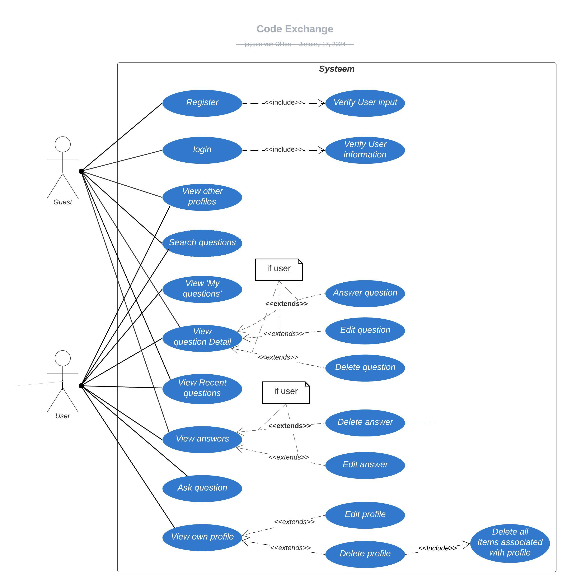

# Expert review

## Inhoudsopgaven

1. [Wat willen wij met dit document laten zien](#wat-willen-wij-met-dit-document-laten-zien)
2. [K5 Object georiënteerd programmeren](#k5-object-georiënteerd-programmeren)
3. [K6 Relationele database](#k6-relationele-database)
4. [K7 Werk beschreven met UML](#k7-werk-beschreven-via-uml)
5. [G4 Werk volgens kwaliteitsnormen](#g4-werk-volgens-kwaliteitsnormen)
6. [G6 Gebruikt bronnen op een passende manier](#g6-gebruikt-bronnen-op-een-passende-manier)
7. [Bronnen](#bronnen)

## Wat willen wij met dit document laten zien

Met dit document laten wij zien dat wij de kwaliteits<!-- - en gedrags -->criteria van de opleiding HBO-ICT begrijpen en ook gebruikt hebben in ons project. De onderdelen zijn per kwaliteits<!-- - en gedrags -->criteria gescheiden. <!-- Eerst de kwaliteitscriteria en daarna de gedragscriteria. -->
Voor het gemak is een inhoudsopgaven aan het begin van dit document gemaakt. Aan het einde van dit document bevinden de bronnen die gebruikt zijn met het maken van deze documentatie.

## K5 Object georiënteerd programmeren

Met het onderdeel "K5 Object georiënteerd programmeren" geven wij bewijs dat we volgens [de richtlijnen van de opleiding HBO-ICT Object georiënteerd programmeren](https://knowledgebase.hbo-ict-hva.nl/1_beroepstaken/software/ontwerpen/oop/0_oop_intro/) gewerkt hebben. Dat doen wij door de "Object georiënteerd programmeren" per onderdeel te benoem met voorbeelden uit het project als bewijs.

Verder hebben we voor een beter beeld van object georiënteerd programmeren gebruik gemaakt van ["LinkedIn Learning: Programming Foundations: Object-Oriented Design" door "Barron Stone en Olivia Chiu Stone"](https://www.linkedin.com/learning/programming-foundations-object-oriented-design-3/).

Ook is de * [Google TypeScript Style Guide](https://google.github.io/styleguide/tsguide.html) gebruikt om een idee te krijgen van het schrijven van de constructor en de manier dat de attributen geïnitialiseerd worden. Hiervoor zijn vooral de onderdelen [4.4.4 Construtors](https://google.github.io/styleguide/tsguide.html#constructors) en [4.4.5 Class members](https://google.github.io/styleguide/tsguide.html#class-members) gebruikt.

### Abstraction
Hieronder staan voorbeelden van "Abstraction". Deze voorbeelden tonen gebruik van abstractie, omdat het mogelijk is veel meer info van een gebruiker of een bericht in een class te stoppen. Dat is overbodige informatie die niet nodig is ons programma. Hier is dus abstractie gebruikt om alleen de nodige informatie te gebruiken.

#### User (Abstraction)  

*Auteur: Jayson*  

**Hoe wordt Abstractie gebruikt?**  
De attributen in de User class zijn een goed voorbeeld van abstraction, omdat overbodige gegevens die niet nodig zijn voor ons programma weg gelaten zijn.

De attributen genaamd username, email, firstname, preposition, en lastname worden gebruikt om gegevens te tonen op de pagina. 

De attribuut id wordt gebruikt ter identificatie en controle of deze gebruiker de rechten heeft voor unieke onderdelen, zoals Questions, Answers, en Profile bewerken en verwijderen. Ook wordt deze attribuut gebruikt om de gegevens van de user in de database terug te vinden. 

<!-- **Hoe wordt Encapsulation gebruikt**
De attributen id, username, en email worden geïnitialiseerd via de AbstractUser. De waarde id en username zijn public omdat de waarde van deze attributen direct opgehaald worden vanaf buiten de class. De attribuut email staat in de AbstractUser als protected, hierdoor wordt de attribuut van email als private behandeld als deze vanaf buiten de User class opgeroepen wordt.   -->

**Wat doet de code?**  
De User class gebruikt inheritance op de AbstractUser class.
De User class wordt gebruikt voor als representatie van een gebruiker. Het kan de gebruiker updaten en verwijderen, van de database doormiddel van het gebruik van een API.

**Bronnen:**  
* ["LinkedIn Learning: Programming Foundations: Object-Oriented Design" door "Barron Stone en Olivia Chiu Stone"](https://www.linkedin.com/learning/programming-foundations-object-oriented-design-3/)
* [HBO-ICT Pijlers van OOP](https://knowledgebase.hbo-ict-hva.nl/1_beroepstaken/software/ontwerpen/oop/pijlers_van_oop/#abstractie)
* [Google TypeScript Style Guide](https://google.github.io/styleguide/tsguide.html)

**UML:**  


**Code**  
```typescript
import { api } from "@hboictcloud/api";
import { AbstractUser } from "./abstractUser";

/** */
export class User extends AbstractUser {
    //constructor and constructor
    public constructor(
        id: number,
        username: string,
        email: string,
        private _firstname: string,
        private _preposition: string,
        private _lastname: string
    ) {
        super(id, username, email);
    }

    //getters and setters
    ***
    //database functions
    ***
}
```
#### Profile (Abstraction)  

*Auteur: Jayson*

**Hoe wordt Abstractie gebruikt?**  
De attributen in de Profile class zijn een goed voorbeeld van abstraction, omdat overbodige gegevens die niet nodig zijn voor ons programma weg gelaten zijn.

De attributen genaamd birthdate, experience, expertise, title, about, gitlab, profilePicture, username, en email worden gebruikt om aan de gebruiker en andere gebruikers te tonen, wanneer ze de profiel pagina bekijken. 

De attribuut userID wordt gebruikt om te controleren of de huidige gebruiker deze gegevens mag aanpassen. 

De attribuut id wordt gebruikt om deze profiel gegevens terug te vinden in de database. Dit is voor als de gegevens verwijderd of bijgewerkt worden. 

**Wat doet de code?**  
De Profile class gebruikt inheritance op de AbstactUser class.
De Profile class wordt gebruikt om een pagina over de gebruiker te tonen. Deze informatie is beschikbaar voor andere als de gebruiker deze gegevens heeft ingevuld. Dit zijn onder andere: geboortedatum, jaar ervaring, expertise level, titel van pagina, omschrijving gebruiker, Gitlab gebruikersnaam.

**Bronnen:**  
* ["LinkedIn Learning: Programming Foundations: Object-Oriented Design" door "Barron Stone en Olivia Chiu Stone"](https://www.linkedin.com/learning/programming-foundations-object-oriented-design-3/)
* [HBO-ICT Pijlers van OOP](https://knowledgebase.hbo-ict-hva.nl/1_beroepstaken/software/ontwerpen/oop/pijlers_van_oop/#abstractie)
* [Google TypeScript Style Guide](https://google.github.io/styleguide/tsguide.html)

**UML:**  


**Code**  
```typescript
import { api, utils } from "@hboictcloud/api";
import { AbstractUser } from "./abstractUser";

/** */
export class Profile extends AbstractUser {
    // attributes and constructor
    public constructor(
        id: number,
        private _userID: number,
        private _birthdate: string,
        private _experience: number,
        private _expertise: string,
        private _title: string,
        private _about: string,
        private _gitlab: string,
        private _profilePicture: any,
        username: string,
        email: string
    ) {
        super(id, username, email);
    }

    //getters and setters
    ***
    //database functions
    ***
    //print functions
    ***
}
```

#### Question (Abstraction)

*Auteur: Wesley*

**Hoe wordt Abstractie gebruikt?**  
De attributen in de Question class zijn een goed voorbeeld van abstraction, omdat overbodige gegevens die niet nodig zijn voor ons programma weg gelaten worden.

De attributen genaamd content, codeSnippet, creationDate, dateModified, title, tags, username, expertise, answers, en isModified worden gebruikt op elke pagina om de gegevens te tonen. 

De attribuut genaamd id wordt gebruikt om de Question gegevens te identificeren in de database. 

De attribuut genaamd userID staat in deze class, zodat het mogelijk is bij het printen van de pagina als de userID overeenkomt met de id van de ingelogde gebruiker dat de bewerk en verwijder knoppen gemaakt worden.

**Wat doet de code?**  
Deze class gebruikt inheritance van de Post class. Deze class vertegenwoordigt een vraag.
Het kan question in de database updaten en verwijderen, door middel van een API.
Het kan de vraag op de pagina weergeven.

**Bronnen:**  
* ["LinkedIn Learning: Programming Foundations: Object-Oriented Design" door "Barron Stone en Olivia Chiu Stone"](https://www.linkedin.com/learning/programming-foundations-object-oriented-design-3/)
* [HBO-ICT Pijlers van OOP](https://knowledgebase.hbo-ict-hva.nl/1_beroepstaken/software/ontwerpen/oop/pijlers_van_oop/#abstractie)
* [Google TypeScript Style Guide](https://google.github.io/styleguide/tsguide.html)

**UML**  


**Code**  
```typescript
import { api, url } from "@hboictcloud/api";
import { Post } from "./post";

/** */
export class Question extends Post {
    //constructor
    public constructor(
        id: number,
        userID: number,
        content: string,
        codeSnippet: string,
        creationDate: string,
        dateModified: string,
        private _title: string,
        private _tags: string,
        username: string,
        expertise: string,
        private _answers: number,
        isModified: boolean
    ) {
        super(id, userID, content, codeSnippet, username, expertise, creationDate, dateModified, isModified);
    }

    //getters and setters
    ***
    //database functions
    ***
    //check functions
    ***
    //print functions
    ***
}
```

#### Answer (Abstraction)

*Auteur: Wesley*

**Hoe wordt Abstraction gebruikt?**
De attributen in de Answer class zijn een goed voorbeeld van abstraction, omdat overbodige gegevens die niet nodig zijn voor ons programma weggelaten zijn. 

De attributen content, codesnippet, creationDate, dateModified, isAnswerAccepted, username, expertise, isModified, hasVoted, userVoteScore, averageVoteScore, en countVotes worden gebruikt om gegeven te tonen op de pagina. 

De attributen genaamd id en questionID worden gebruikt om de Answer gegevens te identificeren in de database. 

De attribuut genaamd userID staat in deze class, zodat het mogelijk is bij het printen van de pagina als de userID overeenkomt met de id van de ingelogde gebruiker dat de verwijder en bewerk knoppen gemaakt worden. 

**Wat doet de code?**  
Deze class gebruikt inheritance op de Post class. Deze class vertegenwoordigt een antwoord.
Het kan de antwoordt van de database verwijderen en updaten, door middel van de API.
Het kan de antwoordt op de pagina weergeven. 

**Bronnen:**  
* ["LinkedIn Learning: Programming Foundations: Object-Oriented Design" door "Barron Stone en Olivia Chiu Stone"](https://www.linkedin.com/learning/programming-foundations-object-oriented-design-3/)
* [HBO-ICT Pijlers van OOP](https://knowledgebase.hbo-ict-hva.nl/1_beroepstaken/software/ontwerpen/oop/pijlers_van_oop/#abstractie)
* [Google TypeScript Style Guide](https://google.github.io/styleguide/tsguide.html)

**UML**  


**Code**  
```typescript
import { api } from "@hboictcloud/api";
import { Post } from "./post";

/** */
export class Answer extends Post {
    //constructor
    public constructor(
        id: number,
        userID: number,
        content: string,
        codeSnippet: string,
        creationDate: string,
        dateModified: string,
        private _questionID: number,
        private _isAnswerAccepted: boolean,
        username: string,
        expertise: string,
        isModified: boolean,
        private _hasVoted: boolean,
        private _userVoteScore: number,
        private _averageVoteScore: number,
        private _countVotes: number
    ) {
        super(id, userID, content, codeSnippet, username, expertise, creationDate, dateModified, isModified);
    }

    //getters and setters
    ***
    //database functions
    ***
    //check functions
    ***
    //print functions
    ***
}
```

### Encapsulation 
Hieronder staan voorbeelden van "Encapsulation". Deze voorbeelden tonen gebruik van inkapseling, omdat de eigenschappen afgeschermd zijn en alleen bekeken en bewerkt kan worden door gebruik te maken van de methode van de class zelf.

Alle voorbeelden gebruiken inheritance, dat de eigenschappen ook afgeschermd zijn in de parent class is terug te zien in de UML afbeeldingen.

#### User (Encapsulation)  

*Auteur: Jayson*  

**Hoe wordt Encapsulation gebruikt?**  
Dit is een goed voorbeeld van Encapsulation, omdat de attributen en functies alleen vanaf private worden gehaald als deze door externe methode direct opgevraagd worden.

De attributen genaamd username, email, firstname, preposition, en lastname worden gebruikt om gegevens te tonen op de pagina. Deze worden door de class zelf geprint. De attributen username en email worden niet buiten deze class gebruikt en zijn daarom private. De attributen firstname, preposition, en lastname worden wel gebruikt buiten de class, omdat deze waarde eerst behandeld moeten worden hebben deze een getter gekregen. De getter controleert of de preposition bestaat en aan de hand van dat keert de getter een combinatie van de firstname, lastname en/of preposition terug. De attributen worden dus niet direct verkregen en blijven dus op private staan.

De attribuut id wordt gebruikt ter identificatie en controle of deze gebruiker de rechten heeft voor unieke onderdelen, zoals Questions, Answers en Profile bewerken en verwijderen. Ook wordt deze attribuut gebruikt om de gegevens van de user in de database terug te vinden. Deze attribuut word direct opgevraagd door andere classes, daarom staat deze attribuut op public.

**Wat doet de code?**  
De User class gebruikt inheritance op de AbstractUser class.
De User class wordt gebruikt voor als representatie van een gebruiker. Het kan de gebruiker updaten en verwijderen, van de database doormiddel van het gebruik van een API.

**Bronnen:**  
* ["LinkedIn Learning: Programming Foundations: Object-Oriented Design" door "Barron Stone en Olivia Chiu Stone"](https://www.linkedin.com/learning/programming-foundations-object-oriented-design-3/)
* [HBO-ICT Pijlers van OOP](https://knowledgebase.hbo-ict-hva.nl/1_beroepstaken/software/ontwerpen/oop/pijlers_van_oop/#abstractie)
* [Google TypeScript Style Guide](https://google.github.io/styleguide/tsguide.html)

**UML:**  


**Code**  
```typescript
import { api } from "@hboictcloud/api";
import { AbstractUser } from "./abstractUser";

/** */
export class User extends AbstractUser {
    //constructor and constructor
    public constructor(
        id: number,
        username: string,
        email: string,
        private _firstname: string,
        private _preposition: string,
        private _lastname: string
    ) {
        super(id, username, email);
    }

    //getters and setters
    ***
    //database functions
    ***
}
```

#### Profile (Encapsulation)  

*Auteur: Jayson*  

**Hoe wordt Encapsulation gebruikt?**  
Dit is een goed voorbeeld van Encapsulation, omdat de attributen en functies alleen vanaf private worden gehaald als deze door externe methode direct opgevraagd worden.

De attributen genaamd birthdate, experience, expertise, title, about, gitlab, profilePicture, username, en email worden gebruikt om aan de gebruiker en andere gebruikers te tonen, wanneer ze de profiel pagina bekijken. Deze worden niet buiten de class gebruikt en zijn private.

De attribuut userID wordt gebruikt om te controleren of de huidige gebruiker deze gegevens mag aanpassen. Deze wordt niet buiten de class gebruikt en is daarom private.

De attribuut id wordt gebruikt om deze profiel gegevens terug te vinden in de database. Deze wordt niet buiten de class gebruikt en is daarom private.

**Wat doet de code?**  
De Profile class gebruikt inheritance op de AbstactUser class.
De Profile class wordt gebruikt om een pagina over de gebruiker te tonen. Deze informatie is beschikbaar voor andere als de gebruiker deze gegevens heeft ingevuld. Dit zijn onder andere: geboortedatum, jaar ervaring, expertise level, titel van pagina, omschrijving gebruiker, Gitlab gebruikersnaam.

**Bronnen:**  
* ["LinkedIn Learning: Programming Foundations: Object-Oriented Design" door "Barron Stone en Olivia Chiu Stone"](https://www.linkedin.com/learning/programming-foundations-object-oriented-design-3/)
* [HBO-ICT Pijlers van OOP](https://knowledgebase.hbo-ict-hva.nl/1_beroepstaken/software/ontwerpen/oop/pijlers_van_oop/#abstractie)
* [Google TypeScript Style Guide](https://google.github.io/styleguide/tsguide.html)

**UML:**  


**Code**  
```typescript
import { api, utils } from "@hboictcloud/api";
import { AbstractUser } from "./abstractUser";

/** */
export class Profile extends AbstractUser {
    // attributes and constructor
    public constructor(
        id: number,
        private _userID: number,
        private _birthdate: string,
        private _experience: number,
        private _expertise: string,
        private _title: string,
        private _about: string,
        private _gitlab: string,
        private _profilePicture: any,
        username: string,
        email: string
    ) {
        super(id, username, email);
    }

    //getters and setters
    ***
    //database functions
    ***
    //print functions
    ***
}
```

#### Question (Encapsulation)  

*Auteur: Wesley*  

**Hoe wordt Encapsulation gebruikt?**  
Dit is een goed voorbeeld van Encapsulation, omdat de attributen en functies alleen vanaf private worden gehaald als deze door externe methode direct opgevraagd worden.

De attributen genaamd content, codeSnippet, creationDate, dateModified, title, tags, username, expertise, answers, en isModified worden gebruikt op elke pagina om de gegevens te tonen. Doordat deze class de content zelf maakt worden deze attributen niet buiten deze class gebruikt en zijn deze private.

De attribuut genaamd id wordt gebruikt om de Question gegevens te identificeren in de database. Deze wordt niet buiten de class gebruikt en is daarom private.

De attribuut genaamd userID staat in deze class, zodat het mogelijk is bij het printen van de pagina als de userID overeenkomt met de id van de ingelogde gebruiker dat de edit en delete knoppen gemaakt worden. Deze attribuut wordt niet buiten deze class gebruik en is daarom private.

**Wat doet de code?**  
Deze class gebruikt inheritance van de Post class. Deze class vertegenwoordigt een vraag.
Het kan question in de database updaten en verwijderen, door middel van een API.
Het kan de vraag op de pagina weergeven.

**Bronnen:**  
* ["LinkedIn Learning: Programming Foundations: Object-Oriented Design" door "Barron Stone en Olivia Chiu Stone"](https://www.linkedin.com/learning/programming-foundations-object-oriented-design-3/)
* [HBO-ICT Pijlers van OOP](https://knowledgebase.hbo-ict-hva.nl/1_beroepstaken/software/ontwerpen/oop/pijlers_van_oop/#abstractie)
* [Google TypeScript Style Guide](https://google.github.io/styleguide/tsguide.html)

**UML**  


**Code**  
```typescript
import { api, url } from "@hboictcloud/api";
import { Post } from "./post";

/** */
export class Question extends Post {
    //constructor
    public constructor(
        id: number,
        userID: number,
        content: string,
        codeSnippet: string,
        creationDate: string,
        dateModified: string,
        private _title: string,
        private _tags: string,
        username: string,
        expertise: string,
        private _answers: number,
        isModified: boolean
    ) {
        super(id, userID, content, codeSnippet, username, expertise, creationDate, dateModified, isModified);
    }

    //getters and setters
    ***
    //database functions
    ***
    //check functions
    ***
    //print functions
    ***
}
```

#### Answer (Encapsulation)  

*Auteur: Wesley*  

**Hoe wordt Encapsulation gebruikt?**  
Dit is een goed voorbeeld van Encapsulation, omdat de attributen en functies alleen vanaf private worden gehaald als deze door externe methode direct opgevraagd worden.

De attributen content, codesnippet, creationDate, dateModified, isAnswerAccepted, username, expertise, isModified, hasVoted, userVoteScore, averageVoteScore, en countVotes worden gebruikt om gegeven te tonen op de pagina. Doordat deze class de content zelf maakt worden deze attributen niet buiten deze class gebruikt en zijn deze private.

De attribuut genaamd id en questionID worden gebruikt om de Answer gegevens te identificeren in de database. Deze worden niet buiten deze class gebruikt en zijn daarom private

De attribuut genaamd userID staat in deze class, zodat het mogelijk is bij het printen van de pagina als de userID overeenkomt met de id van de ingelogde gebruiker dat de "edit" en "delete" knoppen gemaakt worden. Deze attributen worden buiten deze class niet gebruikt en zijn daarom private.

**Wat doet de code?**  
Deze class gebruikt inheritance op de Post class. Deze class vertegenwoordigt een antwoord.
Het kan de antwoordt van de database verwijderen en updaten, door middel van de API.
Het kan de antwoordt op de pagina weergeven. 

**Bronnen:**  
* ["LinkedIn Learning: Programming Foundations: Object-Oriented Design" door "Barron Stone en Olivia Chiu Stone"](https://www.linkedin.com/learning/programming-foundations-object-oriented-design-3/)
* [HBO-ICT Pijlers van OOP](https://knowledgebase.hbo-ict-hva.nl/1_beroepstaken/software/ontwerpen/oop/pijlers_van_oop/#abstractie)
* [Google TypeScript Style Guide](https://google.github.io/styleguide/tsguide.html)

**UML**  


**Code**  
```typescript
import { api } from "@hboictcloud/api";
import { Post } from "./post";

/** */
export class Answer extends Post {
    //constructor
    public constructor(
        id: number,
        userID: number,
        content: string,
        codeSnippet: string,
        creationDate: string,
        dateModified: string,
        private _questionID: number,
        private _isAnswerAccepted: boolean,
        username: string,
        expertise: string,
        isModified: boolean,
        private _hasVoted: boolean,
        private _userVoteScore: number,
        private _averageVoteScore: number,
        private _countVotes: number
    ) {
        super(id, userID, content, codeSnippet, username, expertise, creationDate, dateModified, isModified);
    }

    //getters and setters
    ***
    //database functions
    ***
    //check functions
    ***
    //print functions
    ***
}
```

### Inheritance
Hieronder staan voorbeelden van "Inheritance". In deze voorbeelden wordt gebruik gemaakt van erfenis, omdat de classes Question en Answer de class Post gebruikt voor de overeenkomende eigenschappen en methoden. De classes User en Profile gebruiken de class AbstractUser voor de overeenkomende eigenschappen en methode. Het gebruik van inheritance is dus goede manier om code te hergebruiken.

#### User (Inheritance)  

*Auteur: Jayson*  

**Hoe wordt Inheritance gebruikt?**  
De User gebruikt inheritance door extends te gebruiken.
In de User class worden de attributen die in de AbstractUser class via super() in de constructor geïnitialiseerd. 

De methodes in AbstractUser worden zijn bruikbaar vanaf de User class. Een goed voorbeeld hiervan is terug te zien in de toString() deze gebruikt via super.toString() de methode uit de AbstractUser class.

Hiervoor is gekozen omdat de gegevens overeenkomen met de gegevens die in de Profile class zitten, waardoor de gegevens maar op één plek aanwezig zijn en de code maar op één plek geschreven hoeft te worden. 

**Wat doet de code?**  
De User class gebruikt inheritance op de AbstractUser class.
De User class wordt gebruikt voor als representatie van een gebruiker. Het kan de gebruiker updaten en verwijderen, van de database doormiddel van het gebruik van een API.

**Bronnen:**  
* ["LinkedIn Learning: Programming Foundations: Object-Oriented Design" door "Barron Stone en Olivia Chiu Stone"](https://www.linkedin.com/learning/programming-foundations-object-oriented-design-3/)
* [HBO-ICT Pijlers van OOP](https://knowledgebase.hbo-ict-hva.nl/1_beroepstaken/software/ontwerpen/oop/pijlers_van_oop/#abstractie)
* [Google TypeScript Style Guide](https://google.github.io/styleguide/tsguide.html)

**UML:**  


**Code**  
```typescript
/** */
export class AbstractUser {
    // attributes and constructor
    public constructor(
        private _id: number,
        private _username: string,
        private _email: string
        ) {}

    //getters and setters
    ***
    //this is used to return a string representing this instance
    public toString(): string {
        return `AbstractUser: id: ${this._id}
        username: ${this._username}
        email: ${this._email}`;
    }
    //database functions
    ***
}
```

```typescript
import { api } from "@hboictcloud/api";
import { AbstractUser } from "./abstractUser";

/** */
export class User extends AbstractUser {
    // attributes and constructor
    public constructor(
        id: number,
        username: string,
        email: string,
        private _firstname: string,
        private _preposition: string,
        private _lastname: string
    ) {
        super(id, username, email);
    }

    //getters and setters
    ***
    //this is used to return a string representing this instance and parent class
    public toString(): string {
        return `${super.toString()}
        User: firstname: ${this._firstname}
        proposition: ${this._preposition}
        lastname: ${this._lastname}`;
    }
    //database functions
    ***
}
```

#### Profile (Inheritance)  

*Auteur: Jayson*  

**Hoe wordt Inheritance gebruikt?**  
De Profile gebruikt inheritance door extends te gebruiken.
In de Profile class worden de attributen die in de AbstractUser class via super() in de constructor geïnitialiseerd. 

De methodes in AbstractUser worden zijn bruikbaar vanaf de Profile class. Een goed voorbeeld hiervan is terug te zien in de toString() deze gebruikt via super.toString() de methode uit de AbstractUser class.

Hiervoor is gekozen omdat de gegevens overeenkomen met de gegevens die in de User class zitten, waardoor de gegevens maar op één plek aanwezig zijn en de code maar op één plek geschreven hoeft te worden. 

**Wat doet de code?**  
De Profile class gebruikt inheritance op de AbstactUser class. 
De Profile class wordt gebruikt om een pagina over de gebruiker te tonen. Deze informatie is beschikbaar voor andere als de gebruiker deze gegevens heeft ingevuld. Dit zijn onder andere: geboortedatum, jaar ervaring, expertise level, titel van pagina, omschrijving gebruiker, Gitlab gebruikersnaam.

**Bronnen:**  
* ["LinkedIn Learning: Programming Foundations: Object-Oriented Design" door "Barron Stone en Olivia Chiu Stone"](https://www.linkedin.com/learning/programming-foundations-object-oriented-design-3/)
* [HBO-ICT Pijlers van OOP](https://knowledgebase.hbo-ict-hva.nl/1_beroepstaken/software/ontwerpen/oop/pijlers_van_oop/#abstractie)
* [Google TypeScript Style Guide](https://google.github.io/styleguide/tsguide.html)

**UML:**  


**Code**  
```typescript
/** */
export class AbstractUser {
    // attributes and constructor
    public constructor(
        private _id: number,
        private _username: string,
        private _email: string
        ) {}

    //getters and setters
    ***
    //this is used to return a string representing this instance
    public toString(): string {
        return `AbstractUser: id: ${this._id}
        username: ${this._username}
        email: ${this._email}`;
    }
    //database functions
    ***
}
```

```typescript
import { api, utils } from "@hboictcloud/api";
import { AbstractUser } from "./abstractUser";

/** */
export class Profile extends AbstractUser {
    // attributes and constructor
    public constructor(
        id: number,
        private _userID: number,
        private _birthdate: string,
        private _experience: number,
        private _expertise: string,
        private _title: string,
        private _about: string,
        private _gitlab: string,
        private _profilePicture: any,
        username: string,
        email: string
    ) {
        super(id, username, email);
    }

    //getters and setters
    ***
    public toString(): string {
        const userInfo: string = `${super.toString()}
        Profile: userID ${this.userID}
        birthdate: ${this.birthdate}
        experience: ${this.experience}
        expertise: ${this.expertise}
        title: ${this.title}
        about: ${this.about}
        gitlab: ${this.gitlab}`;

        console.log(userInfo);
        return userInfo;
    }
    //database functions
    ***
    //print functions
    ***
}
```

#### Question (Inheritance)  

*Auteur: Wesley*  

**Hoe wordt Inheritance gebruikt?**  
De Question gebruikt inheritance door extends te gebruiken.
In de Question class worden de attributen die in de Post class via super() in de constructor geïnitialiseerd. 

De methodes in Post worden zijn bruikbaar vanaf de Question class. Een goed voorbeeld hiervan is terug te zien in de toString() deze gebruikt via super.toString() de methode uit de Question class.

De methoden toString, update, en delete worden overriden omdat de methodes dan beter passen bij de Question class.

Hiervoor is gekozen omdat de gegevens overeenkomen met de gegevens die in de Answer class zitten, waardoor de gegevens maar op één plek aanwezig zijn en de code maar op één plek geschreven hoeft te worden. 

**Wat doet de code?**  
Deze class gebruikt inheritance van de Post class. Deze class vertegenwoordigt een vraag.
Het kan question in de database updaten en verwijderen, door middel van een API.
Het kan de vraag op de pagina weergeven.

**Bronnen:**  
* ["LinkedIn Learning: Programming Foundations: Object-Oriented Design" door "Barron Stone en Olivia Chiu Stone"](https://www.linkedin.com/learning/programming-foundations-object-oriented-design-3/)
* [HBO-ICT Pijlers van OOP](https://knowledgebase.hbo-ict-hva.nl/1_beroepstaken/software/ontwerpen/oop/pijlers_van_oop/#abstractie)
* [Google TypeScript Style Guide](https://google.github.io/styleguide/tsguide.html)

**UML**  


**Code**  
```typescript
/** */
export class Post {
    //attributes and constructor
    public constructor(
        private _id: number,
        private _userID: number,
        private _content: string,
        private _codeSnippet: string,
        private _username: string,
        private _expertise: string,
        private _creationDate: string,
        private _dateModified: string,
        private _isModified: boolean
    ) {}

    // Getters en setters
    ***
    //this is used to return an string representation this instance
    public toString(): string {
        return `Post: id: ${this._id}
        userID: ${this._userID}
        content: ${this._content}
        codeSnippet: ${this._codeSnippet}
        username: ${this._username}
        expertise: ${this._expertise}
        creationDate: ${this._creationDate}
        dateModified: ${this._dateModified}
        isModified: ${this._isModified}`;
    }
    //database functions
    ***
}
```

```typescript
import { api, url } from "@hboictcloud/api";
import { Post } from "./post";

/** */
export class Question extends Post {
    //attributes and constructor
    public constructor(
        id: number,
        userID: number,
        content: string,
        codeSnippet: string,
        creationDate: string,
        dateModified: string,
        private _title: string,
        private _tags: string,
        username: string,
        expertise: string,
        private _answers: number,
        isModified: boolean
    ) {
        super(id, userID, content, codeSnippet, username, expertise, creationDate, dateModified, isModified);
    }

    //getters and setters
    ***
     //this is used to return an string representation this instance, including the parent class
    public toString(): string {
        return `Post: ${super.toString()}
        Question: title: ${this.title}
        tags: ${this.tags}
        answers: ${this.answers}`;
    }
    //database functions
    ***
    //check functions
    ***
    //print functions
    ***
}
```

#### Answer (Inheritance)

*Auteur: Wesley*

**Hoe wordt Abstraction gebruikt?**
De Answer class gebruikt inheritance door extends te gebruiken.
In de Answer class worden de attributen die in de Post class via super() in de constructor geïnitialiseerd. 

De methodes in Post worden zijn bruikbaar vanaf de Answer class. Een goed voorbeeld hiervan is terug te zien in de toString() deze gebruikt via super.toString() de methode uit de Answer class.

De methoden toString, update, en delete worden overriden omdat de methodes dan beter passen bij de Answer class.

Hiervoor is gekozen omdat de gegevens overeenkomen met de gegevens die in de Question class zitten, waardoor de gegevens maar op één plek aanwezig zijn en de code maar op één plek geschreven hoeft te worden. 

**Wat doet de code?**  
Deze class gebruikt inheritance op de Post class. Deze class vertegenwoordigt een antwoord.
Het kan de antwoordt van de database verwijderen en updaten, door middel van de API.
Het kan de antwoordt op de pagina weergeven. 

**Bronnen:**  
* ["LinkedIn Learning: Programming Foundations: Object-Oriented Design" door "Barron Stone en Olivia Chiu Stone"](https://www.linkedin.com/learning/programming-foundations-object-oriented-design-3/)
* [HBO-ICT Pijlers van OOP](https://knowledgebase.hbo-ict-hva.nl/1_beroepstaken/software/ontwerpen/oop/pijlers_van_oop/#abstractie)
* [Google TypeScript Style Guide](https://google.github.io/styleguide/tsguide.html)

**UML**  


```typescript
/** */
export class Post {
    //attributes and constructor
    public constructor(
        private _id: number,
        private _userID: number,
        private _content: string,
        private _codeSnippet: string,
        private _username: string,
        private _expertise: string,
        private _creationDate: string,
        private _dateModified: string,
        private _isModified: boolean
    ) {}

    // Getters en setters
    ***
    //this is used to return an string representation this instance
    public toString(): string {
        return `Post: id: ${this._id}
        userID: ${this._userID}
        content: ${this._content}
        codeSnippet: ${this._codeSnippet}
        username: ${this._username}
        expertise: ${this._expertise}
        creationDate: ${this._creationDate}
        dateModified: ${this._dateModified}
        isModified: ${this._isModified}`;
    }
    //database functions
    ***
}
```

```typescript
import { api } from "@hboictcloud/api";
import { Post } from "./post";

/** */
export class Answer extends Post {
    //attributes and constructor
    public constructor(
        id: number,
        userID: number,
        content: string,
        codeSnippet: string,
        creationDate: string,
        dateModified: string,
        private _questionID: number,
        private _isAnswerAccepted: boolean,
        username: string,
        expertise: string,
        isModified: boolean,
        private _hasVoted: boolean,
        private _userVoteScore: number,
        private _averageVoteScore: number,
        private _countVotes: number
    ) {
        super(id, userID, content, codeSnippet, username, expertise, creationDate, dateModified, isModified);
    }

    //getters and setters
    ***
    //this is used to return an string representation this instance, including the parent class
    public toString(): string {
        return `Post: ${super.toString()}
        Answer: questionID: ${this.questionID}
        isAnswerAccepted: ${this.isAnswerAccepted}`;
    }
    //database functions
    ***
    //check functions
    ***
    //print functions
    ***
}
```

### Polymorphism 
Hieronder zijn voorbeelden van "Polymorphism". Deze voorbeelden tonen gebruik van polymorfisme, omdat de child classen dezelfde methoden naam gebruiken via inheritance van de parent class en roep je de methoden op dezelfde manier op. Toch is functie door overriding inhoudelijk anders. Hierdoor kan de uitkomst erg verschillen en de functie om de uitkomst te bereiken ook.

#### User (Polymorphism)  

*Auteur: Jayson*  

**Hoe wordt Polymorphism gebruikt?**  
De user class gebruikt inheritance op de AbstractUser class.

De methodes in AbstractUser worden zijn bruikbaar vanaf de User class. Een goed voorbeeld hiervan is terug te zien in de toString() deze gebruikt via super.toString() de methode uit de Profile class.

De methoden toString, update, en delete worden overridden omdat de methodes dan beter passen bij de Profile class. Dit wordt gedaan door dezelfde methode naam en aantal parameters te gebruiken.

**Wat doet de code?**  
De User class gebruikt inheritance op de AbstractUser class.
De User class wordt gebruikt voor als representatie van een gebruiker. Het kan de gebruiker updaten en verwijderen, van de database doormiddel van het gebruik van een API.

**Bronnen:**  
* ["LinkedIn Learning: Programming Foundations: Object-Oriented Design" door "Barron Stone en Olivia Chiu Stone"](https://www.linkedin.com/learning/programming-foundations-object-oriented-design-3/)
* [HBO-ICT Pijlers van OOP](https://knowledgebase.hbo-ict-hva.nl/1_beroepstaken/software/ontwerpen/oop/pijlers_van_oop/#abstractie)
* [Google TypeScript Style Guide](https://google.github.io/styleguide/tsguide.html)

**UML:**  


**Code**  
```typescript
/** */
export class AbstractUser {
    // attributes and constructor
    ***

    //getters and setters
    ***
    //this is used to return a string representing this instance
    public toString(): string {
        return `AbstractUser: id: ${this._id}
        username: ${this._username}
        email: ${this._email}`;
    }
    //database functions
    /** */
    public update(): void {
        const error: string = "This message for update from AbstractUser should not show";
        console.log(error);
    }

    /** */
    public delete(): void {
        const error: string = "This message for delete from AbstractUser should not show";
        console.log(error);
    }
}
```

```typescript
import { api } from "@hboictcloud/api";
import { AbstractUser } from "./abstractUser";

/** */
export class User extends AbstractUser {
    // attributes and constructor
    ***

    //getters and setters
    ***
    //this is used to return a string representing this instance and parent class
    public toString(): string {
        return `${super.toString()}
        User: firstname: ${this._firstname}
        proposition: ${this._preposition}
        lastname: ${this._lastname}`;
    }
    //database functions
    /** */
    public async update(): Promise<void> {
        try {
            await api.queryDatabase(
                `
                UPDATE user
                SET username = ?, email = ?, firstname = ?, preposition = ?, lastname = ?
                WHERE userID = ?;
                `,
                this.username,
                this.email,
                this._firstname,
                this._preposition,
                this._lastname,
                this.id
            );
        } catch (error) {
            console.error(error);
        }
    }

    /** */
    public async delete(): Promise<void> {
        try {
            await api.queryDatabase(
                `
                DELETE FROM user
                WHERE userID = ?;
                `,
                this.id
            );
        } catch (error) {
            console.log(error);
        }
    }
}
```

#### Profile (Polymorphism)  

*Auteur: Jayson*  

**Hoe wordt Polymorphism gebruikt?**  
De user class gebruikt inheritance op de AbstractUser class.

De methodes in AbstractUser worden zijn bruikbaar vanaf de Profile class. Een goed voorbeeld hiervan is terug te zien in de toString() deze gebruikt via super.toString() de methode uit de Profile class.

De methoden toString, update, en delete worden overridden omdat de methodes dan beter passen bij de Profile class. Dit wordt gedaan door dezelfde methode naam en aantal parameters te gebruiken.

**Wat doet de code?**  
De Profile class gebruikt inheritance op de AbstractUser class.
De Profile class wordt gebruikt voor als representatie van een gebruiker. Het kan de gebruiker updaten en verwijderen, van de database doormiddel van het gebruik van een API.

**Bronnen:**  
* ["LinkedIn Learning: Programming Foundations: Object-Oriented Design" door "Barron Stone en Olivia Chiu Stone"](https://www.linkedin.com/learning/programming-foundations-object-oriented-design-3/)
* [HBO-ICT Pijlers van OOP](https://knowledgebase.hbo-ict-hva.nl/1_beroepstaken/software/ontwerpen/oop/pijlers_van_oop/#abstractie)
* [Google TypeScript Style Guide](https://google.github.io/styleguide/tsguide.html)

**UML:**  


**Code**  
```typescript
/** */
export class AbstractUser {
    // attributes and constructor
    ***

    //getters and setters
    ***
    //this is used to return a string representing this instance
    public toString(): string {
        return `AbstractUser: id: ${this._id}
        username: ${this._username}
        email: ${this._email}`;
    }
    //database functions
    /** */
     public update(): void {
        const error: string = "This message for update from AbstractUser should not show";
        console.log(error);
    }

    /** */
    public delete(): void {
        const error: string = "This message for delete from AbstractUser should not show";
        console.log(error);
    }
}
```

```typescript
import { api, utils } from "@hboictcloud/api";
import { AbstractUser } from "./abstractUser";

/** */
export class Profile extends AbstractUser {
    // attributes and constructor
    ***

    //getters and setters
    ***
    public toString(): string {
        const userInfo: string = `${super.toString()}
        Profile: userID ${this.userID}
        birthdate: ${this.birthdate}
        experience: ${this.experience}
        expertise: ${this.expertise}
        title: ${this.title}
        about: ${this.about}
        gitlab: ${this.gitlab}`;

        console.log(userInfo);
        return userInfo;
    }
    //database functions
    /** */
    public async update(): Promise<void> {
        try {
            console.log(this.birthdate);
            const query: string =
                `
                UPDATE profile
                SET birthdate = ?, experience = ?, expertise = ?, title = ?, about = ?, gitlab = ?, profilePicture = ?
                WHERE profileID = ?;
                `;
            console.log(query);
            const data: any = await api.queryDatabase(
                query,
                this.birthdate,
                this.experience,
                this.expertise,
                this.title,
                this.about,
                this.gitlab,
                this.profilePicture,
                this.id
            );
            console.log("has updated");
            console.log(data);
        } catch (error) {
            console.error(error);
        }
    }

    /** */
    public async delete(): Promise<void> {
        try {
            await api.queryDatabase(
            `
            DELETE FROM user
            WHERE userID = ?;
            `,
            this.userID
            );
        } catch (error) {
            console.log(error);
        }
    }
    //print functions
    ***
}
```

#### Question (Polymorphism)  

*Auteur: Wesley*  

**Hoe wordt Polymorphism gebruikt?**  
De Question class gebruikt inheritance op de Post class.

De methodes in Post worden zijn bruikbaar vanaf de Question class. Een goed voorbeeld hiervan is terug te zien in de toString() deze gebruikt via super.toString() de methode uit de Question class.

De methoden toString, update, en delete worden overridden omdat de methodes dan beter passen bij de Question class. Dit wordt gedaan door dezelfde methode naam en aantal parameters te gebruiken.

**Wat doet de code?**  
Deze class gebruikt inheritance van de Post class. Deze class vertegenwoordigt een vraag.
Het kan question in de database updaten en verwijderen, door middel van een API.
Het kan de vraag op de pagina weergeven.

**Bronnen:**  
* ["LinkedIn Learning: Programming Foundations: Object-Oriented Design" door "Barron Stone en Olivia Chiu Stone"](https://www.linkedin.com/learning/programming-foundations-object-oriented-design-3/)
* [HBO-ICT Pijlers van OOP](https://knowledgebase.hbo-ict-hva.nl/1_beroepstaken/software/ontwerpen/oop/pijlers_van_oop/#abstractie)

**UML**  


**Code**  
```typescript
/** */
export class Post {
    //attributes and constructor
    ***
    // Getters en setters
    ***
    //this is used to return an string representation this instance
    public toString(): string {
        return `Post: id: ${this._id}
        userID: ${this._userID}
        content: ${this._content}
        codeSnippet: ${this._codeSnippet}
        username: ${this._username}
        expertise: ${this._expertise}
        creationDate: ${this._creationDate}
        dateModified: ${this._dateModified}
        isModified: ${this._isModified}`;
    }
    //database functions
    /** */
    public async update(): Promise<void> {
        const error: string = "This message for update from Post should not show";
        console.log(error);
    }

    /** */
    public async delete(): Promise<void> {
        const error: string = "This message for delete from Post should not show";
        console.log(error);
    }

}
```

```typescript
import { api, url } from "@hboictcloud/api";
import { Post } from "./post";

/** */
export class Question extends Post {
    //attributes and constructor
    ***

    //getters and setters
    ***
     //this is used to return an string representation this instance, including the parent class
    public toString(): string {
        return `Post: ${super.toString()}
        Question: title: ${this.title}
        tags: ${this.tags}
        answers: ${this.answers}`;
    }
    //database functions
    /** */
    public async update(): Promise<void> {
        //sending to server
        try {
            await api.queryDatabase(
                `
                UPDATE question
                SET content = ?, codeSnippet = ?
                WHERE questionID = ?;
                `,
                this.content,
                this.codeSnippet,
                this.id
            );
        } catch (error) {
            console.error(error);
        }
    }
    /** */
    public async delete(): Promise<void> {
        try {
            await api.queryDatabase(
                `
                DELETE FROM question
                WHERE questionID = ?
                `,
                this.id
            );
        } catch (error) {
            console.error(error);
        }
    }

    ***
    //check functions
    ***
    //print functions
    ***
}
```

#### Answer (Polymorphism)  

*Auteur: Wesley*  

**Hoe wordt Polymorphism gebruikt?**  
De Answer class gebruikt inheritance op de Post class.

De methodes in Post worden zijn bruikbaar vanaf de Answer class. Een goed voorbeeld hiervan is terug te zien in de toString() deze gebruikt via super.toString() de methode uit de Answer class.

De methoden toString, update, en delete worden overridden omdat de methodes dan beter passen bij de Answer class. Dit wordt gedaan door dezelfde methode naam en aantal parameters te gebruiken.

**Wat doet de code?**  
Deze class gebruikt inheritance op de Post class. Deze class vertegenwoordigt een antwoord.
Het kan de antwoordt van de database verwijderen en updaten, door middel van de API.
Het kan de antwoordt op de pagina weergeven. 

**Bronnen:**  
* ["LinkedIn Learning: Programming Foundations: Object-Oriented Design" door "Barron Stone en Olivia Chiu Stone"](https://www.linkedin.com/learning/programming-foundations-object-oriented-design-3/)
* [HBO-ICT Pijlers van OOP](https://knowledgebase.hbo-ict-hva.nl/1_beroepstaken/software/ontwerpen/oop/pijlers_van_oop/#abstractie)

**UML**  


**Code**  
```typescript
/** */
export class Post {
    //attributes and constructor
    ***
    // Getters en setters
    ***
    //this is used to return an string representation this instance
    public toString(): string {
        return `Post: id: ${this._id}
        userID: ${this._userID}
        content: ${this._content}
        codeSnippet: ${this._codeSnippet}
        username: ${this._username}
        expertise: ${this._expertise}
        creationDate: ${this._creationDate}
        dateModified: ${this._dateModified}
        isModified: ${this._isModified}`;
    }
    //database functions
    /** */
    public async update(): Promise<void> {
        const error: string = "This message for update from Post should not show";
        console.log(error);
    }

    /** */
    public async delete(): Promise<void> {
        const error: string = "This message for delete from Post should not show";
        console.log(error);
    }

}
```

```typescript
import { api } from "@hboictcloud/api";
import { Post } from "./post";

/** */
export class Answer extends Post {
    //attributes and constructor
    ***

    //getters and setters
    ***
    //this is used to return an string representation this instance, including the parent class
    public toString(): string {
        return `Post: ${super.toString()}
        Answer: questionID: ${this.questionID}
        isAnswerAccepted: ${this.isAnswerAccepted}`;
    }
    //database functions
    /** */
    public async update(): Promise<void> {
        try {
            await api.queryDatabase(
                `
                UPDATE answer
                SET content = ?, codeSnippet = ?
                WHERE answerID = ?;
                `,
                this.content,
                this.codeSnippet,
                this.id
            );
        } catch (error) {
            console.error(error);
        }
    }

    /** */
    public async delete(): Promise<void> {
        console.log(this.toString());
        console.log(this.id);
        try {
            const query: string =
                `
                DELETE FROM answer
                WHERE answerID = ?;
                `;
            await api.queryDatabase(query, this.id);
        } catch (error) {
            console.error(error);
        }
    }

    ***
    //check functions
    ***
    //print functions
    ***
}
```

## K6 Relationele database

Met het onderdeel "K6 Relationele database" geven wij bewijs dat we volgens [de richtlijnen van de opleiding HBO-ICT Relationele Databases Ontwerpen](https://knowledgebase.hbo-ict-hva.nl/1_beroepstaken/software/ontwerpen/relationele_databases/0_relationele_databases/) gewerkt hebben.

### Ontwerp

Hierin geven we het ontwerp van de database weer. Dit doen wij door middel van de ERD (Entity Relationship Diagram) en de EERD (Extended Entitiy Relationship diagram) hieronder te tonen onder hun eigen kopjes. Ook wordt met voorbeelden getoond dat we kennis bezitten van Create, Delete, Instert, Select, en Update.

#### Entity Relationship Diagram
*Jayson*  


#### Extended Entitiy Relationship diagram
*Wesley*  


### Create
De volgende code snippet in SQL is gebruikt voor het maken van de tabel user in de database.
Deze is direct via MySQl Workbench ingevoerd en meteen uitgevoerd.

*Jayson*  
```sql
CREATE TABLE `user` (
  `userID` int(11) NOT NULL AUTO_INCREMENT,
  `username` varchar(255) NOT NULL,
  `password` blob NOT NULL,
  `email` varchar(255) NOT NULL,
  `firstname` varchar(255) NOT NULL,
  `preposition` varchar(255) DEFAULT NULL,
  `lastname` varchar(255) NOT NULL,
  PRIMARY KEY (`userID`),
  UNIQUE KEY `email_UNIQUE` (`email`),
  UNIQUE KEY `username_UNIQUE` (`username`)
);
```

De volgende code snippet in SQL is gebruikt voor het maken van de tabel answer in de database.
Deze is direct via MySQl Workbench ingevoerd en meteen uitgevoerd.

*Wesley*  
```sql
CREATE TABLE `answer` (
  `answerID` int(11) NOT NULL AUTO_INCREMENT,
  `questionID` int(11) DEFAULT NULL,
  `userID` int(11) DEFAULT NULL,
  `content` text NOT NULL,
  `codeSnippet` text,
  `creationDate` timestamp NULL DEFAULT CURRENT_TIMESTAMP,
  `dateModified` timestamp NULL DEFAULT CURRENT_TIMESTAMP ON UPDATE CURRENT_TIMESTAMP,
  `isAnswerAccepted` tinyint(1) DEFAULT '0',
  PRIMARY KEY (`answerID`),
  KEY `answer_ibfk_1` (`questionID`),
  KEY `answer_ibfk_2` (`userID`),
  CONSTRAINT `answer_ibfk_1` FOREIGN KEY (`questionID`) REFERENCES `question` (`questionid`) ON DELETE CASCADE,
  CONSTRAINT `answer_ibfk_2` FOREIGN KEY (`userID`) REFERENCES `user` (`userid`) ON DELETE CASCADE
);
```


### Delete
De volgende code snippet in Typsecript is gebruikt voor het verwijderen van gebruikers gegevens in de database.
Deze is van de Class User genaamd delete.

*Jayson*  
```typescript
    await api.queryDatabase(
        `
        DELETE FROM user
        WHERE userID = ?;
        `,
        this.id
    );
```

De volgende code snippet in Typsecript is gebruikt voor het verwijderen van vraag gegevens in de database.
Deze is van de Class Question genaamd delete.

*Wesley*  
```typescript
    await api.queryDatabase(
        `
        DELETE FROM question
        WHERE questionID = ?
        `,
        this.id
    );

```

### Insert into
De volgende code snippet in Typescript is gebruikt voor het toevoegen van nieuwe gebruikers gegevens in de database.
Deze is van de Class UserManger genaamd addUser.

*Jayson*  
```typescript
    const query: string = 
        `
        INSERT INTO user (username, email, password, firstname, preposition, lastname)
        VALUES (?, ?, ?, ?, ?, ?);
        `;
    const databaseCommand: any = await api.queryDatabase(
        query,
        username,
        email,
        password,
        firstname,
        preposition,
        lastname
    );
```

De volgende code snippet in Typescript is gebruikt voor het toevoegen van nieuwe vraag gegevens in de database.
Deze is van de Class PostManager genaamd addQuestion. 

*Wesley*  
```typescript
    const query: string = 
        `
        INSERT INTO question (userID, title, content, codeSnippet, tags) 
        VALUES (?, ?, ?, ?, ?);
        `;
    const data: any = await api.queryDatabase(
        query, 
        userID, 
        title, 
        content, 
        codeSnippet, 
        tags
    );

```


### Select
De volgende code snippet in Typescript wordt gebruikt voor het selecteren van gebruikers gegevens vanuit de database, als username en password beide voor dezelfde gebruiker overeenkomen.
Deze is van de Class UserManager genaamd login. 

*Jayson*  
```typescript
    const query: string = 
        `
        SELECT userID 
        FROM user 
        WHERE username = ? 
        AND password = ?
        `;
    const data: any = await api.queryDatabase(
        query, 
        username, 
        password
    );
```

De volgende code snippet in Typescript wordt gebruikt voor het selecteren van de antwoorden en de bijbehorende stemmen op de Question detail pagina.
Deze is van de Class PostManager genaamd fetchQuestionDetailPageAnswers.

*Wesley*  
```typescript
    const query: string = `
        SELECT 
            a.answerID, 
            a.questionID, 
            a.userID, 
            a.content, 
            a.codeSnippet, 
            a.creationDate, 
            a.dateModified, 
            u.username, 
            u.email, 
            u.firstname, 
            u.preposition, 
            u.lastname, 
            p.expertise,
            MAX(CASE WHEN v.userID = ? THEN true ELSE false END) AS hasVoted,
            MAX(CASE WHEN v.userID = ? THEN v.voteScore END) AS userVoteScore,
            ROUND(AVG(v.voteScore), 0) AS averageVoteScore,
            COUNT(v.voteScore) as countVotes  
        FROM 
            answer AS a 
        LEFT JOIN 
            user AS u ON a.userID = u.userID
        LEFT JOIN 
            profile AS p ON a.userID = p.userID
        LEFT JOIN
            vote AS v ON a.answerID = v.answerID
        WHERE 
            a.questionID = ?
        GROUP BY
            a.answerID
        ORDER BY 
            a.creationDate DESC;
        `;
    const data: any = await api.queryDatabase(
        query, 
        currentUserID, 
        currentUserID, 
        questionID
    );
```

### Update
De volgende code snippet in Typescript is gebruikt voor het updaten van de gegevens van de gebruiker met de nieuwe gegevens in de database.
Deze is van de Class User genaamd update.

*Jayson*  
```typescript
    await api.queryDatabase(
        `
        UPDATE user
        SET username = ?, email = ?, firstname = ?, preposition = ?, lastname = ?
        WHERE userID = ?;
        `,
        this.username,
        this.email,
        this._firstname,
        this._preposition,
        this._lastname,
        this.id
    );    
```

De volgende code snippet in Typescript is gebruikt voor het updaten van de gegevens van de question met de nieuwe gegevens in de database.
Deze is van de Class Question genaamd update.

*Wesley*  
```typescript
    await api.queryDatabase(
        `
        UPDATE question
        SET content = ?, codeSnippet = ?
        WHERE questionID = ?;
        `,
        this.content,
        this.codeSnippet,
        this.id
    );
```

## K7 Werk beschreven via UML

Met het onderdeel "K7 Werk beschreven via UML" geven wij bewijs dat we volgens [de richtlijnen van de opleiding HBO-ICT Unified Modeling Language (UML)](https://knowledgebase.hbo-ict-hva.nl/1_beroepstaken/software/ontwerpen/uml/0_uml/) gewerkt heb.

Om de Class Diagram en Use Case Diagram beter te begrijpen hebben we gebruik gemaakt van ["LinkedIn Learning: Programming Foundations: Object-Oriented Design" door "Barron Stone en Olivia Chiu Stone"](https://www.linkedin.com/learning/programming-foundations-object-oriented-design-3/).

[De gehele technische documentatie voor verder voorbeelden van UML](https://gitlab.fdmci.hva.nl/propedeuse-hbo-ict/onderwijs/2023-2024/out-d-se-gd/blok-2/joovuuzeefee27/-/blob/main/docs/technische%20documentatie.md?ref_type=heads#technische-documentatie)

### UML Class Diagram
*Wesley*  
De Class Diagram vertegenwoordigt de relaties tussen de classes die wij gebruikt hebben voor onze website via Unified Modeling Language.

**Wat doen de classes:**  
De classes zijn hieronder even samengevat met hun acties en interacties.

De Usermanager heeft meerdere functie die met de gebruiker te maken hebben. Hieronder vallen:
- Gebruikers en hun profiel in de database aanmaken.
- Pagina aanpassen voor de gebruiker wel of niet ingelogd is.
- User en Profiel classes aanmaken en terugsturen.

De PostManager heeft meerder functies die met de vragen en antwoorden te maken hebben. Hieronder vallen:
- Antwoorden en vragen aanmaken,
- Question en Answer classes aanmaken en terugsturen.

AbstractUser en Post zijn abstracte classes die gebruikt worden om overeenkomende attributen en methodes op één plek te hebben staan. Question en Answer hebben deze in Post staan en Profile en User in AbstractUser.

De Profile class representeert het profiel van de gebruiker zelf en andere gebruikers. De handeling van de Profiel class zijn:
- Gegevens op pagina printen,
- Bewerken en verwijderen van de gegevens van de gebruiker met betrekking tot het profiel.

De User class representeert de ingelogde gebruiker. De handeling van de User class zijn:
- De voornaam, tussenvoegsels, en achternaam als string terugsturen,
- Bewerken van gegevens en verwijderen van de gebruiker,
- Controle punt zijn via de id van de gebruiker voor alle andere classes.

De Question class representeert de vragen. De handeling van de Question class zijn:
- Bewerken en verwijderen van de vraag,
- Vraag als onderdeel van een lijst te printen,
- Vraag met alle detail te printen.

De Answer class representeert de antwoorden. De handeling van de Answer class zijn:
- Bewerken en verwijderen van het antwoord,
- Bewerken en verwijderen van de gestemde score,
- Antwoord op de pagina te printen,
- Gemiddelde en gestemde score printen op de pagina.  

**Bronnen:**  
* ["LinkedIn Learning: Programming Foundations: Object-Oriented Design" door "Barron Stone en Olivia Chiu Stone"](https://www.linkedin.com/learning/programming-foundations-object-oriented-design-3/)
* [HBO-ICT Pijlers van OOP](https://knowledgebase.hbo-ict-hva.nl/1_beroepstaken/software/ontwerpen/oop/pijlers_van_oop/#abstractie)

**Diagram**  


### UML Use case diagram
*Jayson*  
De use case diagram hieronder representeert de functionaliteiten van onze code exchange website. Het identificeert de actors 'Guest (niet ingelogde gebruiker)' en 'User (ingelogde gebruiker)'. Deze actors ondergaan interacties zoals het bekijken, stellen, bewerken en verwijderen van vragen en antwoorden. Daarnaast omvat het gebruikersgerelateerde acties zoals inloggen/registreren, profielbeheer en het bekijken van persoonlijke vragen. De "extends" relaties geven aan dat bepaalde acties, zoals het bewerken en verwijderen van vragen, alleen beschikbaar zijn voor geregistreerde gebruikers. De "includes" relaties wijzen aan dat bepaalde acties, zoals het checken van het controleren van gebruikers gegegevens, of alle dingen die geassocieerd zijn met het account gelijk verwijderen als het account word verwijderd. 

Om dit te bereiken, heb ik gebruik gemaakt van de volgende bronnen: 
- [UML use case diagrams (Youtube video)](https://www.youtube.com/watch?v=4emxjxonNRI)
- ["LinkedIn Learning: Programming Foundations: Object-Oriented Design" door "Barron Stone en Olivia Chiu Stone"](https://www.linkedin.com/learning/programming-foundations-object-oriented-design-3/)




<!-- ## G4 Werk volgens kwaliteitsnormen

Tijdens het werken aan ons project hanteren we nog steeds de richtlijnen van de opleiding HBO-ICT voor de onderdelen van [Code conventies](https://knowledgebase.hbo-ict-hva.nl/1_beroepstaken/software/realiseren/code_conventies/0_code_conventies/), zoals [Naamgeving](https://knowledgebase.hbo-ict-hva.nl/1_beroepstaken/software/realiseren/code_conventies/naamgeving/0_naamgeving/), [Commentaar](https://knowledgebase.hbo-ict-hva.nl/1_beroepstaken/software/realiseren/code_conventies/code_commentaar/), [Code layout](https://knowledgebase.hbo-ict-hva.nl/1_beroepstaken/software/realiseren/code_conventies/code_layout/) en vermijden van [Magic numbers](https://knowledgebase.hbo-ict-hva.nl/1_beroepstaken/software/realiseren/code_conventies/magic_numbers/). Dit is terug te zien in de voorbeelden van [K6 Relationele database](#k6-relationele-database).

## G6 Gebruikt bronnen op een passende manier.

De bronnen zijn onderaan bij "[Bronnen](#bronnen)" in het document genoteerd zodat deze overzichtelijk te bekijken zijn. Bij alle bronnen staat aangegeven waarvan ze zijn en gelinkt naar waar ze staan op het web. Hierdoor zijn ze dus makkelijk terug te vinden en te controleren.

Tevens zijn bij alle onderdelen de daarvoor gebruikte bronnen nog eens vermeld voor de duidelijkheid. -->

## Bronnen

Gelinkte documenten:

-   [Technische documentatie](https://gitlab.fdmci.hva.nl/propedeuse-hbo-ict/onderwijs/2023-2024/out-d-se-gd/blok-2/joovuuzeefee27/-/blob/main/docs/technische%20documentatie.md?ref_type=heads#technische-documentatie)

Bronnen van school:

-   [HBO-ICT Object geörienteerd programmeren](https://knowledgebase.hbo-ict-hva.nl/1_beroepstaken/software/ontwerpen/oop/0_oop_intro/)
-   [HBO-ICT Relationele Databases Ontwerpen](https://knowledgebase.hbo-ict-hva.nl/1_beroepstaken/software/ontwerpen/relationele_databases/0_relationele_databases/)
-   [HBO-ICT Unified Modeling Language (UML)](https://knowledgebase.hbo-ict-hva.nl/1_beroepstaken/software/ontwerpen/uml/0_uml/)
-   [HBO-ICT Code Conventies](https://knowledgebase.hbo-ict-hva.nl/1_beroepstaken/software/realiseren/code_conventies/0_code_conventies/)
-   [HBO-ICT Naamgeving](https://knowledgebase.hbo-ict-hva.nl/1_beroepstaken/software/realiseren/code_conventies/naamgeving/0_naamgeving/)
-   [HBO-ICT Commentaar](https://knowledgebase.hbo-ict-hva.nl/1_beroepstaken/software/realiseren/code_conventies/code_commentaar/)
-   [HBO-ICT Code layout](https://knowledgebase.hbo-ict-hva.nl/1_beroepstaken/software/realiseren/code_conventies/code_layout/)
-   [HBO-ICT Magic numbers](https://knowledgebase.hbo-ict-hva.nl/1_beroepstaken/software/realiseren/code_conventies/magic_numbers/)

Bronnen buiten school:

-   ["Learn Typescript" cursus van Codecademy](https://www.codecademy.com/learn/learn-typescript)
-   ["LinkedIn Learning: Programming Foundations: Object-Oriented Design" door "Barron Stone en Olivia Chiu Stone"](https://www.linkedin.com/learning/programming-foundations-object-oriented-design-3/)
-   ["Bootstrap Navbar"](https://getbootstrap.com/docs/4.0/components/navbar/)
-   ["Huemint - Kleurenschema"](https://huemint.com/website-3/#palette=fcf9e7-d6dadc-00215b-055fa5-f5561f-f9ca16)
-   ["Stack Overflow - Fill the remaining height or width in a flex container"](https://stackoverflow.com/questions/37745051/fill-the-remaining-height-or-width-in-a-flex-container)
-   [Google TypeScript Style Guide](https://google.github.io/styleguide/tsguide.html)
-   [UML use case diagrams (Youtube video)](https://www.youtube.com/watch?v=4emxjxonNRI)


<!--
sprint 1
| 2 | K5 | Je hebt object georiënteerd geprogrammeerd en maakt gebruik van objectgeoriënteerde technieken zoals abstraction, inheritance en encapsulation. | S-O, S-R |
| 2 | K6 | Je hebt een genormaliseerde relationele database ontworpen en gebruikt om informatie uit je project in op te slaan, op te halen en te bewerken. | S-O, S-R |
| 2 | K7 | Je hebt je werk beschreven met behulp van UML-technieken. | S-R, S-MC |

| 4 | G4 | Je werkt volgens (gegeven) kwaliteitsnormen. | TO-M |
| 4 | G6 | Je gebruikt bronnen om antwoorden te vinden op een passende manier. | OP-O |
-->

<!--


https://gitlab.fdmci.hva.nl/propedeuse-hbo-ict/onderwijs/2023-2024/out-d-se-gd/blok-2/joovuuzeefee27/-/blob/main/docs/sprint-3/expert%20review.md?ref_type=heads#expert-review

K5 - zelf: Op niveau / docent:
Via deze onderdeel worden de bewijzen van "Object georiënteerd programmeren" getoond.
(zie bewijs).
Url:
https://gitlab.fdmci.hva.nl/propedeuse-hbo-ict/onderwijs/2023-2024/out-d-se-gd/blok-2/joovuuzeefee27/-/blob/main/docs/sprint-3/expert%20review.md?ref_type=heads#k5-object-geori%C3%ABnteerd-programmeren


K6 - zelf: Op niveau / docent:
Via deze onderdeel worden de bewijzen van "Relationele database" getoond.
(zie bewijs).
Url:
https://gitlab.fdmci.hva.nl/propedeuse-hbo-ict/onderwijs/2023-2024/out-d-se-gd/blok-2/joovuuzeefee27/-/blob/main/docs/sprint-3/expert%20review.md?ref_type=heads#k6-relationele-database


K7 - zelf: Op niveau / docent:
Via deze onderdeel worden de bewijzen van het gebruik van UML getoond.
(zie bewijs).
Url:
https://gitlab.fdmci.hva.nl/propedeuse-hbo-ict/onderwijs/2023-2024/out-d-se-gd/blok-2/joovuuzeefee27/-/blob/main/docs/sprint-3/expert%20review.md?ref_type=heads#k7-werk-beschreven-via-uml

Bronnen
Url:
https://gitlab.fdmci.hva.nl/propedeuse-hbo-ict/onderwijs/2023-2024/out-d-se-gd/blok-2/joovuuzeefee27/-/blob/main/docs/sprint-3/expert%20review.md?ref_type=heads#bronnen


Gekregen feedback:


 -->
